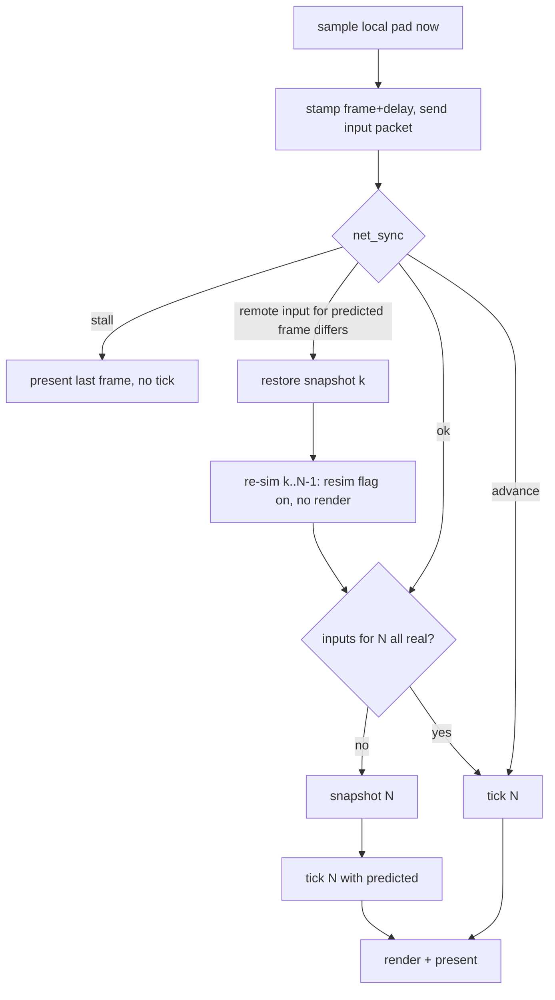

# Netcode plan: rollback, serverless matchmaking, ranked, LAN

Expands ROADMAP.md Phase 4. Everything below is grounded in the current tree
(`file:line`) or a cited external source. Model: Slippi's rollback and set
flow, re-implemented natively; matchmaking and ranked replace Slippi's central
server with the BitTorrent Mainline DHT and signed, on-device rating records.

**Where this stands.** The wire is v5 (`PC_NET_PROTO_VERSION`, `src/pc/net.h:20`).
Netplay plays real matches on Linux x86-64 with rollback, and **M0 is met
between Linux and Windows**: one 2400-frame recording now replays
bit-identical on both, with the harness's byte-flip sensitivity row still
firing at exactly the corrupted frame. Windows and the Apple targets still run
**without** rollback — lockstep for the whole session — and nothing has ever
run on an Android device. Detail in §4 ("Platforms with no snapshot region"),
§5.1 (the determinism gate and the divergence that is now closed), §8
(Android) and §12; the summary:

| Target | Links | Netplay | Rollback | What has actually been run |
|---|---|---|---|---|
| Linux x86-64 | yes, with `melee_state.ld` (`CMakeLists.txt:274-278`) | yes | yes | two instances through real matches, 126k in-match frames and 9k rollbacks in the longest run; the M0 reference recording replays bit-identical |
| Windows x86-64 (MinGW) | yes — **since this batch**; the link used to fail outright on four undefined symbols, and before that the build did not even compile (§4) | yes, lockstep only | no: no snapshot region | the 2400-frame replay is **identical** to the Linux recording (§5.1). Play itself is untested: no two-machine session has been run |
| macOS / iOS | same as Windows: links, no snapshot region | never run | no | nothing — no macOS host and no osxcross toolchain on this machine |
| Android arm64 | yes, with `melee_state.ld` (`CMakeLists.txt:279-284`) | code complete, LAN included | yes | nothing on a device or emulator: none attached. Compile-only, reviewed against the API reference (§8) |

Numbers below are labelled with the harness that produced them, and with the
build, because two defects were fixed mid-batch and several acceptance rows
predate the fixes. Where a claim rests on a harness rather than on two
instances playing, it says so.

## 1. Decisions

| Topic | Decision | Why |
|---|---|---|
| Rollback | Slippi numbers: input delay default 2 (user 0–4), rollback window 7, prediction = repeat last input, snapshot only on predicted frames | Proven on this exact game; native snapshot is cheaper than Dolphin's so delay can go lower |
| Snapshot | Whole-region `memcpy` of game statics + live OSAlloc heaps, audio heap excluded | Same shape as `SlippiSavestate.cpp`; ~2.2 MB statics (measured) + heaps; optimise only if measured > 2 ms |
| Transport | Raw UDP, Slippi packet layout, inputs resent every frame until acked, ~150-line stop-and-wait for lobby messages | No transport lib is linked (`CMakeLists.txt:187`: `melee_game`, `aurora::main` and the platform socket libraries only); ENet only if the reliable channel turns out to be more than that |
| Matchmaking | Mainline DHT (jech/dht, MIT, ~3.1k lines C) — `announce_peer(implied_port=1)` + `get_peers` on time-bucketed topic infohashes; BEP 42 `ip` field for external endpoint; simultaneous UDP open from the same socket | Serverless; the DHT *is* the rendezvous and reports the NAT mapping, so no STUN in v1 |
| NAT failure | Re-queue for another opponent (Slippi behaviour) | No relay = no infrastructure. libjuice (MPL-2.0) only if measured failure rate justifies it |
| Modes | Ranked, Unranked, Direct (connect code), LAN (mDNS) — all one engine, LAN just runs delay 0 | One code path |
| Identity | ed25519 keypair per install (Monocypher, BSD-2/CC0); code = `NAME#XXXX` (XXXX = base32 of pubkey hash) | No accounts; code stable, name free |
| Rating | Weng-Lin / OpenSkill 1v1 update computed identically on both peers from a doubly-signed match record; published as BEP 44 mutable item; hash-chained history | Same family Slippi appears to use; deterministic pure function; verifiable, honestly not cheat-proof |
| Menu | New `SEL_VS_ONLINE` in the VS Mode submenu → `GM_ONLINE` mode with a lobby scene, then vanilla CSS/SSS/VS/Results driven by synced inputs | Native look; reuses `gm_Mode_Vs_States` shape |
| Double Dash decomp | Nothing reusable as code: `NetGameMgr.cpp`/`LANEntry.cpp`/SDK IP stack are empty NonMatching stubs; only `NetGateApp.cpp` and `LANSelectMode.cpp` match. Borrow the UX: counter screen, host-owns-rules, sleep/awake barriers, halt-together | See §8 |

## 2. What the tree gives us today (hook points)

| Concept | Where | Notes |
|---|---|---|
| Frame loop | `gm_801A4D34` `src/melee/gm/gmscene.c:342-410` | Runs one sim tick per queued pad sample (`:373-389`), renders once (`:394-401`). Already "N ticks, one present"; the netplay hooks sit in that loop (`pc_net_sync`, `gm_RunSimTick`, `pc_net_after_tick`, `:375-383`) |
| Sim tick body | `gm_RunSimTick` `gmscene.c:283-341` | `lb_800198E0`→`HSD_PadRenewMasterStatus`, `lb_80019900`, `gm_EvaluateAllControllerInputs` (`:297`), `on_frame`, `lbAudioAx_80027DF8`, `HSD_GObj_RunProcs` (`:325`) |
| Local pad sample | `HSD_PadRenewRawStatus` `src/sysdolphin/baselib/controller.c:55-65` (`PADRead(now)`) | Fired by 1/60 s OSAlarm `fn_800195FC` `src/melee/lb/lb_0195.c:52` (installed `:110`), delivered on the game thread from `pc_os_run_alarms` inside `pc_frame_boundary` (`src/pc/vi.c:202`) |
| Input injection | `HSD_PadRenewMasterStatus` `controller.c:351` reads `p->queue[p->qread]` | Replace the 4×`PADStatus` (16 B each on PC, `extern/aurora/include/dolphin/pad.h:112-126`) here. Everything downstream reads `HSD_PadCopyStatus`, which `HSD_PadRenewCopyStatus` (`controller.c:470`) derives from it (`gm_1A36.c:114-118`, `mncharsel.c:2505-2528`). Keyboard/touch merge into port 0 via `PADSetVirtualStatus` (`src/pc/keyboard.c:294`) — once per frame on the SDL pump thread, gated on window focus except for `MELEE_KEY_FIFO` (§13) |
| Present / pacing / events | `pc_frame_boundary` `src/pc/vi.c:40-212` via `VIWaitForRetrace` `vi.c:213` | the `SDL_DelayPrecise` target at `vi.c:175` is where time-sync nudging goes (`pc_net_pace_adjust_ns`) |
| Frame counter | `gm_80479D58` `gmscene.c:350-355`, advanced per present (`:402-404`) | netplay keeps its own `net.frame`; this is the game's |
| Sound start choke point | `AXDriver_8038CFF4` `src/sysdolphin/baselib/axdriver.c:600`, sole caller `fn_80023750` `src/melee/lb/lbaudio_ax.c:230-246` | Sim thread only links an `HSD_SM` record; voices are acquired on the SDL audio thread (`synth.c:1215`). Returns −1 while re-simulating (`axdriver.c:611`) |
| Music start | `lbAudioAx_80023F28` `lbaudio_ax.c:445` | Gated during re-sim (`:449`) |
| Rumble | `HSD_PadRumbleInterpret` `controller.c:64` | Gate during re-sim |
| RNG | single LCG `seed` `src/sysdolphin/baselib/random.c:3-16`, seeded from `OSGetTick` `src/melee/gm/gmmain.c:169` (`MELEE_SEED` override) | Exchange at connect |
| Match settings | `StartMeleeData` (`StartMeleeRules` 0x60 B + `PlayerInitData[6]`) `src/melee/mn/types.h:259`, in `VsModeData.start` | `onEnterDebugVs` `src/melee/gm/gmvsmode.c:163` is the template for "start GS_VS from a filled struct" |
| Mode/scene tables | `modes[]` `src/melee/gm/gmscdata.c:391`, `scenes[]` `:66`, `gm_Mode_Vs_States` `gmvsmode.c:30-129` | `GM_ONLINE` (`gm/forward.h:65`) and `GS_ONLINE_LOBBY` (`gmscdata.c:376`) are in |
| VS submenu | `mn_803EB6B0[MENU_KIND_VS]` `src/melee/mn/mnmain.c:403-427`, think `mn_8022D594` `:2597`, `SEL_VS_ONLINE = 5` `src/melee/mn/forward.h:171` | done: `selection_count` is 6 (`mnmain.c:423`), the case is at `:2627`, the preview row at `:326` |
| Menu labels | matanim texture frame `start_frame + selection*2` `mnmain.c:1052`, `:1106` (MnMaAll); free text via `HSD_SisLib_803A70A0` (`mncharsel.c:568`) | v1 labels as SIS text, textures later |
| Memory | MEM1 = one 96 MB mmap (`extern/aurora/lib/dolphin/os/OSMemory.cpp:226-290`); no `malloc` in game code; allocator statics outside MEM1 listed in §4 | Game statics: `libmelee_game.a` = 354 KB `.data` + 1.80 MB `.bss` (`size -t`) |
| Threads touching game memory | SDL audio (`src/pc/audio.c:559-575`, every 5 ms), DVD worker + ARQ (`dvd.cpp:560-611`, `AR.cpp:134-149`), FIFO draw-done cb | All bracket with `OSDisableInterrupts` = recursive mutex `src/pc/os.c:33-40` |
| Settings | `launcher.cfg` under `SDL_GetPrefPath` (`src/pc/main.c:330`), `Preferences` `src/pc/launcher_data.hpp:17-40`, `extern "C" pc_is_*` accessors (`launcher.cpp:1595`) | Pattern for `net_delay`, `display_name`, identity path |
| Networking | libcurl (Linux, optional) / WinHTTP for the updater only (`src/pc/updater.cpp:409-611`); nothing on Android/iOS | All net code is new |

## 3. Architecture

Files that exist today are marked ✓; the rest are the M4/M5 shape.

```
src/pc/                PC layer (C, platform compiler)
  net.c              ✓ session, socket, rollback loop, resume phase (§6.5)
  net_internal.h     ✓ shared state, wire structs, module boundaries
  net_wire.c         ✓ big-endian codec, FNV hashes, stick at-rest clamp
  net_sim.c          ✓ link simulator (loss/delay/jitter/reorder/dup/burst)
  net_reliable.c     ✓ two stop-and-wait lanes, 7-bit seq + lane bit
  net_handshake.c    ✓ RULES/READY with per-session nonces (§6.4)
  net_sync.c         ✓ time sync, auto delay, pacing nudge
  net_snapshot.c     ✓ region table, capture/restore ring, record/replay, sync test
  net_lan.c          ✓ mDNS announce/browse (mjansson/mdns), disc identity, lobby, election
  android_compat.cpp ✓ JNI: Wi-Fi multicast lock, device name (§8); no-ops elsewhere
  net_dht.c            jech/dht + BEP 42 ip + BEP 44 put/get, bootstrap cache
  net_match.c          queues (ranked/unranked/direct) on top of the handshake
  net_rank.c           identity, Weng-Lin update, signed records, publish/verify
src/melee/gm/gmonlinemode.c   ✓ GM_ONLINE state machine (lobby → CSS → SSS → VS → Results)
src/melee/mn/mnonline.c       ✓ submenu (LAN / Direct now; Ranked / Unranked / Profile stubs)
src/sysdolphin/baselib/controller.c   ✓ input injection in HSD_PadRenewMasterStatus
src/melee/gm/gmscene.c                ✓ tick body factored into gm_RunSimTick(); the loop calls pc_net_* around it
```

Per-frame flow in online play (wrapped around `gm_RunSimTick`, `gmscene.c:375-383`):



Rules: the game thread owns everything; net I/O is polled from the loop (no
net thread). Snapshot/restore happens under `OSDisableInterrupts` so the audio
callback cannot interleave.

## 4. Rollback engine

**Inputs.** Wire unit = 8 B per port per frame (Slippi's `SlippiPad.h`:
buttons u16, 4 stick s8, 2 trigger u8); expanded to the 16 B PC `PADStatus`
at injection with `err = 0` for both peer ports and `PAD_ERR_NO_CONTROLLER`
for ports 3–4. Local port = P1 for the host (lower pubkey), P2 for the guest.
Stick at-rest clamp ±2 before sending (Slippi `TriggerSendInput.asm:100-125`)
so idle noise does not cause rollbacks.

**Snapshot regions** (`regions_now`, `src/pc/net_snapshot.c:292-310`, plus
`src/pc/melee_state.ld`), in the order they are copied:
1. The `HeapDesc[]` array at the arena start (`aurora_heap_descs`) — list
   heads live outside every cell and the first attempt missed them.
2. `libmelee_game.a` `.data/.bss` bracketed by `__melee_{data,bss}_{start,end}`
   from the GNU ld `INSERT AFTER` script (`melee_state.ld:18-41`), **minus**
   the TUs in the "Excluded state" table below. Each of those was found by
   the sync test, not guessed.
3. Every OSAlloc heap's live extent (`aurora_heap_extent`: allocated cells in
   full, free cells header-only) except the audio heap `HSD_Synth_804D6018`.
   The gameplay heap is `current_heap` (`initialize.c:229`); lbHeap sub-heaps
   hold preloaded read-only file data and are not covered.
4. `HSD_RandSeedPtr` and the word it points at, carried beside the regions
   rather than as one of them (`snapshot_take`/`snapshot_restore`).
5. Netcode's own state lives in `src/pc/net.c`, outside every region.

Measured on a live Link vs Mario match: 5.6 MB, 0.6 ms per snapshot (plain
memcpy). No dirty tracking needed.

**Platforms with no snapshot region (Windows, macOS, iOS).** `melee_state.ld`
is a GNU ld script built on `INSERT AFTER`; PE/COFF's GNU ld and ld64 have no
equivalent, so only the Linux and Android links define the four bracket
symbols (`CMakeLists.txt:274-292`, which is also where `MELEE_STATE_SECTIONS`
is set). Until this batch the other links did not merely lack rollback, they
**failed outright** — `net_snapshot.c` referenced `__melee_data_start`,
`__melee_data_end`, `__melee_bss_start` and `__melee_bss_end`
unconditionally and they were the only undefined symbols on the Windows link,
so netplay could never have run on Windows or macOS at all. Those platforms
now define the four as an empty span and refuse to snapshot rather than
copying the heaps while silently omitting every static, which would roll back
into a desync. `snapshot_state_region_missing()` returns the reason, the
first predicted frame raises the barrier to `INT32_MAX` and logs
`net: this platform's linker cannot bracket the decomp's statics at frame N,
lockstep from here`. The session then plays at lockstep latency — input delay
must cover the whole round trip — with no prediction and no desync risk from
prediction. `ponytail:` the ceiling is named in `net_snapshot.c`; the upgrade
path is per-object section renaming with `objcopy` at archive level, or a PE
linker script if GNU ld accepts `SECTIONS`/`INSERT` for that target. A second
Windows-only breakage was fixed in the same pass and is worth knowing about as
a class: the resume phase's enumerators were `RC_NONE`/`RC_ACTIVE`/`RC_FAILED`,
and mingw-w64's `wingdi.h` defines `RC_NONE` as an empty macro, so the Windows
build did not *compile* (13 errors in `net.c`) let alone link. They are
`RSM_*` now (§6.5). Anything added to `src/pc` in a short, generic, all-caps
spelling should be checked against the Win32 headers before it is assumed
portable.

**Rollback barrier** (`net.rb_barrier`, `src/pc/net.c:138-156`). No frame ≤ the
barrier is ever rolled back to: `fresh_tick` predicts nothing up to it and
runs lockstep instead, and `rollback_to` refuses a restore behind it. It only
rises (`barrier_raise`) and is reset per session.

| Raised by | Barrier | Why |
|---|---|---|
| Scene change (`scene_kind()` differs from the last fresh tick) | `frame + 120` (`IO_QUIET`, `net_internal.h:104`) | heaps are torn down and rebuilt around it and its loads trail into the next frames; a snapshot also records its scene and cannot be taken back in another (`snapshot_unusable`) |
| Game-thread disc request (`pc_net_note_io` from `HSD_DevComRequest`, `devcom.c:417`) | `frame + 120` | the tick that issued it cannot be re-run: a restore either double-issues the read (crash in `HSD_DevComDVDMemCallback`) or erases a completion the re-run then waits for forever; the completion lands on a worker thread some frames later |
| Lost rollback: no snapshot for the frame, behind the barrier, or scene changed (`rollback_to`) | newest simulated frame | the misprediction stays in the timeline, so a desync is expected; one `net: cannot roll back` line per session |
| Snapshot refused — buffer could not be grown, `MELEE_NET_SIM_OOM_FRAME` fired, or this platform has no state region (`snap_predicted`) | `INT32_MAX` | lockstep for the rest of the session (`net: out of memory for snapshots` / the linker message above) |

Aurora still exports `aurora_dvd_inflight()`/`aurora_arq_inflight()`
(`dvd.cpp:687`, `AR.cpp:174`) but the engine no longer consults them: the
audio thread streams music through the same DVD/ARQ path into ARAM all
match, so the counters never read zero during play and could not narrow the
window. Only game-thread requests count, and they cost a fixed 120 frames of
lockstep.

**Excluded state.** Everything a tick can touch that is deliberately not
part of the snapshot, and what stands in for it:

| State | Where excluded | Handling |
|---|---|---|
| Sound machine statics: `axdriver.c`, `synth.c`, `lbaudio_ax.c` | `melee_state.ld:3-4`, `:23` | the SDL audio thread owns them; restoring would tear its lists. Re-sim instead suppresses new sounds (`AXDriver_8038CFF4` returns −1, `axdriver.c:611`) and music starts (`lbaudio_ax.c:449`) via `pc_net_resim()` |
| Audio heap `HSD_Synth_804D6018` | skipped in `regions_now` (`net_snapshot.c:292-310`) | same owner as above |
| `perf.c`, `video.c`, `vtxarray.c`, `lbmthp.c`, `card.c` | `melee_state.ld:5-8` | wall-clock stats, XFB/VI state, host-side caches, THP pacing, async memcard context: engine state, not sim state |
| Pad alarm `lb_0195.c` | `melee_state.ld:9-12` | its fire time is wall-clock; rewinding it made the alarm catch up and queue extra ticks after every rollback. Its frame-skip accumulator is idempotent per tick at 60 Hz |
| Disc/ARAM request queues `devcom.c` | `melee_state.ld:13-16` | driven from the DVD/ARQ worker threads; rewinding them under a completion crashed `HSD_DevComDVDMemCallback`. Game-thread requests raise the barrier instead |
| Pad queue and `HSD_PadLibData` | *inside* the snapshot, but re-applied from the live copy after every restore with interrupts off (`rollback_to`, `net.c:1289-1301`) | raw samples queued since the snapshot survive; re-run ticks consume the slot `unconsume()` hands back (`net.c:1232`), and the online path writes the queue head itself (`write_head`, `net.c:1214-1228`), so a rollback never touches the raw sample stream. Queue type 2 while connected so a full queue drops the new raw sample, not the head (`net.c:1094-1099`) |
| Wall-clock OSAlarms (`src/pc/os.c`) | never copied | ticks are driven by the loop; a time-sync skip is paid at the frame boundary and the pad sample it queues is discarded (`pc_net_pace_adjust_ns`, `net_sync.c:140-150`) |
| ARAM and the music stream | never copied (`net.c:158-165`) | audio-thread traffic through the same DVD path; it does not raise the barrier and its ARAM writes are not sim state |
| File cache (`src/pc/file_cache.cpp`) | not memory state | a hit completes a load in 0 frames, a miss in N: a determinism gap, see the §5 checklist |
| Texture cache (aurora `texture.cpp:47-127`) | never copied | ids only; a stale `GXTexObj` just re-hashes and re-uploads |

**Side effects during re-sim** (`pc_net_resim` flag): `AXDriver_8038CFF4`
returns −1 (`axdriver.c:611`); `lbAudioAx_80023F28` no-op (`lbaudio_ax.c:449`);
the render block runs once per present after the re-tick loop (`gmscene.c:381-383`, render `:394-401`).
Rumble is not gated yet (`HSD_PadRumbleInterpret`, `controller.c:64`, has no
`pc_net_resim` check). v2: Slippi's per-frame SFX log
(16 sounds × 7 frames): dedupe on re-sim, key-off sounds the corrected
timeline never played (`LoopEngineForRollback.asm:70-118`). Sound→sim
feedback exists in exactly two places and is cosmetic: `Ground_801C54DC`
`src/melee/gr/ground.c:3120` (Corneria radio chatter, `grcorneria.c:2621`)
and the tournament screen; leave as known divergence.

**Time sync** (copy Slippi `SlippiNetplay.cpp:1660-1725`, `EXI_DeviceSlippi.cpp:1478-1641`):
offset sample per received packet = `sendTime − myLastSendTime + 16683·(myFrame − theirFrame)`,
30-sample ring, trimmed mean (drop top/bottom third). Every 30 frames: ahead
> 10 ms → stall ≤ 5 frames; behind > 26.7 ms → advance (2 ticks in one
present) ≤ 3 frames, 1 per 5 frames. Continuous nudging: ±0.5–1 % on the
`SDL_DelayPrecise` target in `vi.c:171-175` instead of emu speed. Hard stall
when remote lags > 7 frames; disconnect after 7 s stalled.

**Desync detection.** Each input packet carries `(ck_frame, ck)` of the newest
finalised frame (`confirmed_frame`, `src/pc/net.c:185-193`), compared in
`check_desync` (`net.c:628-639`), which logs `net: DESYNC at frame N (local
… remote …)` once per session. `frame_checksum`
(`src/pc/net_snapshot.c:142-164`) folds the four `PADStatus` as simulated and
the RNG seed always, and each fighter's position, facing, percent,
`motion_id` and stocks **only while `in_fight()`** — player slots keep
dangling entity pointers between scenes. That gate is load-bearing for
reading any result: at a menu or the title the checksum is a pure function of
pads and seed, so two instances sitting on the title screen cannot desync and
cannot roll back, however bad the link. Every acceptance row therefore has to
prove it reached a match before its numbers mean anything (§12). Alongside it
`record_state` keeps a 64-frame ring of exactly what went into the checksum,
dumped around a DESYNC on both peers so the two logs can be diffed by eye.
Ranked will abort the set on a desync; Slippi's synced-state restart is v2.

**Invariants** the engine relies on:
- `s_remote_have` is the newest *contiguous* real remote frame
  (`net.c:52`): a packet's pads are applied only when `first <= have + 1`
  and a gap leaves it where it was, the ack names it so the peer resends
  from there (`on_inputs`, `net.c:399`). `confirmed_frame()` (`net.c:185-193`)
  caps on it, so `check_desync()` never compares a checksum over a predicted frame.
- A snapshot is valid only for the exact frame it was taken for: a restore is
  refused unless `s->frame == f` (`rollback_to`, `net.c:1271-1275`) and every
  session frees all snapshots because the next session restarts at frame 0
  (`snaps_free`, `net_snapshot.c`).
- The reliable channel is two independent stop-and-wait lanes — lane 0 the
  handshake (types < 0x10), lane 1 everything else — carried in bit 7 of the
  8-bit `seq` with a 7-bit sequence below it, so a full or slow caller lane
  can never hold up RULES/READY (`net_reliable.c:1-16`, `:125-157`). Each lane
  has one message in flight and four queued behind it; nothing behind the
  one in flight goes out until its `K` arrives.
- All simulation, snapshot and restore happens on the game thread; the 4 ms
  SDL timer only touches the socket under `net.tx_lock` (`net.c:93-110`,
  `net_internal.h:19-48`), and `pc_net_note_io()` ignores other threads
  (`net.c:161-165`).
- Nothing at or below the barrier is rolled back to (`net.c:1274`); the
  barrier never decreases within a session.
- The session id is chosen by the host (P1) at connect (`net.c:1121`) and
  learned by the guest from the first packet it sees (`net.c:603`); a guest
  with a stale id drops everything until it hears the host.
- Frames 0..delay−1 carry neutral input on both sides (`net.c:1109`,
  `write_head` `net.c:1216`), so the first `delay` frames never need a remote
  packet.

## 5. Determinism prerequisites (M0)

Findings from the flag/libm audit (all four AArch64 targets plus MinGW and Linux):
1. Game code already has `-fno-strict-aliasing -fwrapv -ffp-contract=off` (`CMakeLists.txt:137-139`), but `aurora_mtx`/`aurora_gx` and `src/pc/*.c` do not → AArch64 emits `fmadd` in `PSVECNormalize` (`extern/aurora/lib/dolphin/mtx/vec.c:41`), `PSMTXMultVec`, `C_MTXRotRad`, used by collision (`mplib.c:1183,4919`). Fix: `-ffp-contract=off` on `aurora_mtx`, `aurora_gx`, `aurora_gd`, and the `melee` target.
2. `sinf/cosf/tanf/atanf` resolve to platform libm (glibc / mingw-w64 CRT / bionic / iOS) — used by `fighter.c:2217`, `ftcoll.c:910,2856`, `camera.c`, `ground.c:2882`, `mtx.c:334-379` — and `lbtrigf.c:147` only compiles the decomp's `atanf` under `__MWERKS__`. Fix: vendor one implementation (musl's `sinf/cosf/tanf/atanf`, MIT) into `src/pc/libm/`, `#define sinf pc_sinf` in `src/pc/compat.h` plus `-fno-builtin-sinf …`. `sqrtf/sqrt/fabsf/fmodf` are correctly rounded — leave.
3. Unify `-O2` (Linux is RelWithDebInfo, Windows/Android Release `-O3`: `tools/package_windows.sh:53`, `tools/build_android.sh:41`); keep `MELEE_ENABLE_LTO=OFF`; add `-ftrivial-auto-var-init=zero` to `melee_game`.
4. RNG: force an agreed seed at connect (`gmmain.c:169-174` already honours `MELEE_SEED`); `_HSD_RandForgetMemory` resets per scene (`random.c:23-28`) — must be in the snapshot.
5. Disc I/O: a file-cache hit completes the load synchronously, a miss takes N frames (`src/melee/lb/lbfile.c:145-150`); callbacks run on the DVD worker (`dvd.cpp:560-611`). Rule: prewarm every file the match needs (stage, both fighters, items, SFX banks) behind the "ready" barrier, so every in-match load is a 0-frame hit on both peers. Verify with a load-log injection (`MELEE_LOG_DVD`).
6. Alarms are wall-clock (`src/pc/os.c:174-215`); online ticks are driven by the loop, not the pad alarm.
7. Match-start state that must be identical on both peers (`gm_80167BC8` `src/melee/gm/gm_1601.c:3595-3727`): memcard `GameRules`/`GamePrefs`, handicap, unlock bitmasks (`gm_1601.c:2384`), random-stage switches, frozen-stadium (`grpstadium.c:2057-2067`), Sheik/Zelda A-hold at load (`gmvs.c:1597`). Host ships the 0x60-byte `StartMeleeRules` + `PlayerInitData[4]` + stage + seed + toggles; guest overwrites its copy; unlock-all forced on in online modes.

**Harness.** `MELEE_NET_RECORD=file` writes `MRC1`, the seed, then per frame
the four `PADStatus` as simulated and the frame checksum; `MELEE_NET_REPLAY=file`
feeds the pads back in and reports the first frame whose checksum differs
(`net: REPLAY DIVERGED at frame N`), `record_open`/`replay_feed`/`record_frame`
in `src/pc/net_snapshot.c:57-138`. The record stride in this build is **68
bytes** (`4 × sizeof(PADStatus) + 4`; `PADStatus` is 16 bytes on `TARGET_PC`,
not the 12 its 11 used bytes suggest — `extern/aurora/include/dolphin/pad.h:112-126`
appends `u32 extButton`). Anything reading a recording must divide by 68 or it
reports nonsense frame numbers. `MELEE_NET_STATE_LOG=<file>` writes two lines
per frame to its own block-buffered file (one write per 8 frames, deliberately
*not* through `pc_log_line`, which flushes twice per call and perturbed the
very measurement it was taken for): the existing human-readable `net: state`
line, and a new `net: bits` line carrying the raw float bits of exactly the
fields `frame_checksum` folds, because the readable line rounds to three
decimals and hides the 1-ULP differences worth hunting. `record_state` is
called for every frame, returning immediately unless netplay is running or
this knob is set, so a solo replay can be localised field by field; it is only
useful together with `MELEE_NET_RECORD`/`REPLAY`, since `fresh_tick` does not
run otherwise.

**Checklist (state of the tree):**
- [x] `-ffp-contract=off -fno-fast-math` on `melee_game`, `aurora_mtx`, `aurora_gx`, `aurora_gd` and the `melee` target (`MELEE_FP_FLAGS`, `CMakeLists.txt:46-51`, `:139`, `:183`).
- [x] Trig from `src/pc/libm/` (musl): `pc_trig.h` renames `sinf/cosf/tanf/atanf` (`pc_trig.h:17-20`), pulled in by `compat.h:12` for game code and by `-include` for `aurora_mtx` (`CMakeLists.txt:49`), with `-fno-builtin-*` on both (`:48`, `:140`).
- [x] `-O2` on every platform: `CMAKE_C_FLAGS_RELEASE` is forced to `-O2 -DNDEBUG` (`CMakeLists.txt:20-24`), so the Windows/Android `Release` builds (`package_windows.sh:53`, `build_android.sh:41`) match Linux `RelWithDebInfo`; `-ftrivial-auto-var-init=zero` on `melee_game` (`CMakeLists.txt:141`).
- [x] Agreed seed: `pc_net_connect(seed)` applies it on the host, RULES carries it to the guest, and both re-apply it entering `start_frame` (`net.c:1121-1139`, `hs_done` `net_handshake.c:135-141`); `HSD_RandSeedPtr` and its word are saved and restored with every snapshot.
- [x] Record/replay harness (`MELEE_NET_RECORD`/`MELEE_NET_REPLAY`, `net_snapshot.c:57-138`) and the sync test (`MELEE_NET_SYNCTEST`, `net_snapshot.c`).
- [ ] Tick purity: `MELEE_NET_SYNCTEST` (re-run each tick from a restored snapshot and compare state hashes) still reports mismatches on a replay, so the tick is not yet a pure function of (state, inputs). Numbers, cause and what was ruled out are in §13's first entry; this one gates every other determinism result, including §5.1's.
- [ ] Disc I/O frame counts: a file-cache hit vs miss still changes how many frames a load takes (`lbfile.c:145-150`). The barrier makes the first 120 frames after any game-thread request lockstep (§4), which hides it for rollback, but a load that lands on different frames on the two peers is still a divergence in lockstep. No per-match prewarm behind the ready barrier exists yet; `pc_file_cache_start_prewarm` (`file_cache.cpp:400`) is the boot-time background warm, and `MELEE_PREWARM=0` disables it.
- [x] "An injected 1-ULP libm change is caught" — **done, and it passes.** It could not be executed as written: every math symbol the sim uses is defined inside the executable (`src/pc/libm` + `lbtrigf.c`), so `LD_PRELOAD` has nothing to interpose, and the injection has to happen at build time. The hook is `-DMELEE_FP_PERTURB=sinf|cosf|tanf|atanf` (`CMakeLists.txt:55-80`, `src/pc/libm/pc_perturb.c`, routed through `pc_trig.h`), which returns that function one ULP away from zero on finite non-zero results. Proof: the clean build replays a 1376-frame recording identically; the perturbed build logs `net: fp perturb sinf fired 40335 times by frame 600` and `net: REPLAY DIVERGED at frame 752` — 752 rather than 0 because the checksum only folds fighter state once `in_fight()`. `objdump -d` confirms 166 call sites route to `pc_perturb_sinf` in the perturbed build and to `pc_sinf` in the clean one: the routing is swapped, not added to. Such a build desyncs against every other build by design, so it is fenced four ways — off by default, a CMake `message(WARNING)`, `net: FP PERTURB … never ship` on every run plus a periodic "fired N times" line, and `tools/package_windows.sh` aborting if the staged `melee.exe` carries the marker. (An earlier figure of "24 `sinf` calls in a 2400-frame replay" was wrong by three orders of magnitude and is withdrawn: the counter in the perturbed build measured 40 335 by frame 600. The dynamic-symbol shim that produced it was counting only calls that reached the *platform* libm, which is nearly none, and that is the correct reading of it.)
- [ ] `HSD_PadRumbleInterpret` in re-sim (`controller.c:64`, no gate).
- [~] Cross-platform replay **executed for the first time** by `tools/net_determinism.py`: Linux is self-identical and Windows is not (§5.1). Android and macOS could not be run here at all, and the comparison itself is only as good as §13's first entry — the tick is not yet a pure function of (state, inputs), so this stays open rather than done.
- [ ] Sound→sim feedback (`Ground_801C54DC`, tournament screen): known divergence, cosmetic.

### 5.1 Cross-platform determinism gate (M0), and the Windows divergence

`tools/net_determinism.py` runs M0: it records one reference run on this Linux
build, replays that single file on every platform reachable from this machine,
and reports the first frame whose checksum differs. A platform with no
hardware here is reported SKIPPED and one that never reached the replay is
BLOCKED — neither is ever conflated with "diverged".

The reference run is deliberately not an idle match. `MELEE_DEBUG_VS=cpu` puts
keyboard-driven Link against a level-4 CPU Mario, the harness presses Start
every 2 s until the match's own stage archive appears in the log, then cycles a
fixed 14-line input pattern through `MELEE_KEY_FIFO`. Two gates refuse a
worthless recording before any replay runs (`tools/net_determinism.py:231-258`):
over the last 600 frames at least half the per-frame checksums must change, and
at least 20 frames must carry input. Both failure modes were hit during
development and caught: a fixed-schedule Start drive left the run at the title
for all 3984 frames (frames 141 and 638 produced *literally the same* checksum
`0x41b8c76f`), and matching the bare archive name matched the boot prewarm's
`[FileCache] STORED: GrNLa.dat` instead of the match's `HIT:` line, scoring
91/600 checksum changes against 600/600 for a real match. This is the same
trap as §4's `in_fight()` gate and §12's retracted numbers.

One end-to-end invocation on the current tree, one canonical file
(sha256 `96654c7444af3dcf`, 2400 frames, seed 7):

| platform | frames | first diverging frame | what the row is |
|---|---|---|---|
| linux-record | 2400 | identical | the recording leg against the canonical file: a recording defect cannot masquerade as a platform divergence |
| linux | 2400 | identical | replay of the canonical file |
| linux-flip | 1200 | frame 1200 (expected 1200) | sensitivity check, below |
| windows (Proton) | 2400 | **identical** | replay of the same file, on both the log line and the recorded-stream compare |
| android | – | SKIPPED: no device or emulator attached | – |
| macos | – | SKIPPED: no macOS host, no osxcross toolchain | – |

The canonical file is itself produced by a Linux *replay* leg, not by the
record leg, because the record leg drives input through `MELEE_KEY_FIFO` and
therefore paces differently — and the simulation is sensitive to pacing (§13).
The record-vs-canonical comparison survives as its own row rather than being
assumed away.

Every row needs two independent verdicts: the `net: replay finished at frame N`
/ `net: REPLAY DIVERGED at frame N` log line, and a byte comparison of the
checksum stream the replay leg recorded for itself (every leg also sets
`MELEE_NET_RECORD`) against the reference (`tools/net_determinism.py:260-282`).
Disagreement between the two fails the run as a harness fault, not as a
platform result. The same comparison asserts the pads the leg simulated are
byte-identical to the pads in the file, so a build whose replay silently fed
nothing cannot pass as "identical".

The sensitivity check is what makes the green Linux row mean anything: one byte
is flipped in `PADStatus.stickX` of pad 0 at frame `frames/2`, inside the region
the checksum hashes, and the harness must report divergence at exactly that
frame — byte 81610 → `REPLAY DIVERGED at frame 1200 (recorded efda93d1 now
01e2a60e)`. It also validates the 68-byte stride: a wrong stride would land the
flip on a different frame.

**Windows used to diverge at the first in-fight frame; it no longer does, and
the cause was a launcher preference reaching the simulation.** The
investigation is worth keeping in full, because every intermediate conclusion
was wrong in an instructive way.

Measured first: three Proton replays diverged at the same frame with
byte-identical checksums, and `MELEE_NET_STATE_LOG` (§5) showed **only the RNG
seed differed** — position, facing, percent, `motion_id` and stocks equal to
the bit on both platforms. `HSD_Rand` is an LCG
(`src/sysdolphin/baselib/random.c:3-16`), so the seeds are countable: Windows
made exactly **one fewer draw** in the tick that enters the fight. That
excluded float arithmetic — libm, FMA, `-ffp-contract`, optimisation level,
physics codegen — *by measurement*, since all of those perturb a mantissa and
none was perturbed.

Two attributions along the way were wrong, and both are worth naming:

- **Not the card-absent save data.** A probe inside the four unlock predicates
  measured the stage mask, the character mask and the feature byte as `0x0000`
  on **both** platforms. That default is a deliberate zero, built by the
  `memzero` in `gmMainLib_8015F600` (`src/melee/gm/gmmain_lib.c:1414`).
- **Not `gm_80164600` at `ground.c:1441`.** GCC cross-jumps the six identical
  `HSD_Randi(RANDI_MAX)` sites of `Ground_801C24F8` into one call, so a
  backtrace naming that line cannot name the `case`. A probe printing the
  switch selector and every predicate showed `x14 = 6` on both platforms: the
  roll is `case 6`, gated by **`gm_80164ABC`** ("are all unlockable characters
  unlocked"). `gm_80164600` answered 0 on both and was never the cause. **A
  merged call site in a backtrace is not evidence of which arm ran.**

The differing input was `unlock_all` in **`launcher.cfg`** — 1 in the Linux
install, 0 in the Wine prefix, because `pc_launcher_configure` loads that file
from `SDL_GetPrefPath()` and Proton resolves it inside the prefix.
`pc_is_unlock_all_enabled()` is an early-out in three of the four unlock
predicates (`gm_1601.c:2273`, `:2402`, `:2463`) but not the fourth, so from
identical all-zero save data the two hosts answered differently, one
`HSD_Randi(100)` alt-BGM roll was skipped on one side, and the seeds parted for
ever. A host-local preference file was an input to the simulation.

**The fix** makes the card-absent default itself unlocked, in
`gmMainLib_8015F600` immediately after the `memzero` that establishes it
(`gmmain_lib.c:1312-1316`), gated on `aurora_card_is_present()` — the
`--no-card` flag, exported for this at
`extern/aurora/lib/dolphin/card.cpp:42`. It sits at the one point every path
that rebuilds the default save routes through: boot, soft reset, data delete,
and the card-absent memory-card scene — which is where an earlier version of
the fix was silently undone, because with `--no-card` the game still enters
that scene and rebuilds the default (found with a gdb watchpoint on the mask).
`CARDProbe` was deliberately not the test: it also answers false when a card
image is merely missing, which would silently unlock a fresh install. Three
alternatives were rejected for reasons worth recording — adding the missing
early-out to the fourth predicate puts the simulation's dependency on
`launcher.cfg` in *one more* place (that preference is read at ~60 predicate
call sites, several gating RNG draws: `ground.c:1404`, `:1413`, `:1431`,
`gmmain_lib.c:875`, `it_279C.c:1221`); deriving the masks from the preference
keeps the host-local file as the input; removing the early-outs deletes the
feature for card users.

With the masks full, all four predicates answer from save data on every
platform whatever `launcher.cfg` says, and the harness reports the windows row
`identical` over all 2400 frames on both verdicts. The property that matters on
one machine was tested too: two instances with separate `launcher.cfg`, one
`unlock_all 1` and one `0`, now force the same masks — pre-fix they answered
the predicate differently, which is the same-machine form of the same bug.

A second, unrelated LP64 defect was fixed in the same function: the default
save was cleared with a literal `memzero(…, 0x10A30)` — the GameCube size of
`struct gmm_x0`, while the struct measures `0x10C88` on this build because
pointers inside it grew — leaving the last `0x258` bytes unreset on every soft
reset and data delete. Invisible at boot, stale afterwards; it is `sizeof(*…)`
now (`gmmain_lib.c:1414`).

**Read this as a class, not an incident.** Save-data-derived predicates gate
RNG draws, so *any* disagreement in unlock state between two peers makes one
draw and the other not, and they desync on that frame with identical fighter
state — which is also the best explanation for the DESYNC §12.2 reports in the
online flow. The wire side of that is now closed: unlock state is hashed into
the handshake and forced for the session (§6.4). A future predicate that reads
some *other* host-local state reintroduces the class.

One suspect from the original list survives, untested and no longer needed for
this fork: **reads of uninitialised heap**. `-ftrivial-auto-var-init=zero`
covers automatic storage but not OSAlloc cells; `MELEE_HEAP_CHECK=1` and
aurora's canary/backtrace support are the tools if a future divergence points
that way. They were not run, and no claim about heap is made here.
Kept for the record, since both were checked and both stay true: the two
targets compile the game with identical flags (`-O2 -DNDEBUG -std=gnu11
-fpermissive -fno-strict-aliasing -fwrapv -ffp-contract=off -fno-fast-math
-fno-builtin-{sinf,cosf,tanf,atanf} -ftrivial-auto-var-init=zero
-fexec-charset=CP932`, differing only in `-fPIC` versus `-mno-ms-bitfields`,
GCC 16.2.1 and 16.2.0, neither with FMA in the baseline); and although the
platform libms *do* differ — 20000-sample bit comparison of glibc against
mingw-w64 under Wine: `atan2f` 3276 mismatches, `acosf` 1537, `asinf` 1369,
`sinf` 245, `cosf` 231, all exactly 1 ULP, `powf`/`expf`/`logf`/`fmodf`/`sqrtf`
0 — routing the simulation's trig into the tree (`pc_trig.h`) removes them as
a suspect. `sizeof(long)` differs (8 versus 4) but every struct the checksum
reads measures the same on both: `Fighter` 11584 bytes with `cur_pos` 196,
`facing_dir` 64, `motion_id` 20, `dmg` 8112; `HSD_GObj` 96 with `classifier` 0
and `user_data` 72.

**Two measurement defects had to be fixed before any of this was trustworthy**,
and they are worth knowing as a class. First, a run was not reproducible from
its own recording: the same binary replaying what it had just recorded diverged
at frame 1359 (1066 on another recording) *reproducibly*, while two independent
replays of that recording were bit-identical to each other — the first
differing frame was always the first frame of an input transition. Second, the
instrument moved what it measured: with the state log going through
`pc_log_line` (which flushes stderr *and* the log file on every call, four
flushes a frame) the divergence moved from 1359 to 1360, and turning the log on
could take a replay from "identical over 1376 frames" to "diverges at 1359".
The state log now writes its own block-buffered file, one write per 8 frames,
and is verified non-perturbing: with it on, the record leg, the canonical
replay and a second replay agree on all 2400 frames.

**The Windows build, and three defects that had to be fixed to get one.** The
numbers above come from a `build-win` deleted and rebuilt from scratch, which
now starts under Proton with no hand-copying at all. Getting there took three
separate fixes, each worth remembering as a class:

1. **It did not compile.** `net.c` declared `enum { RC_NONE, RC_ACTIVE,
   RC_FAILED }` and mingw-w64's `wingdi.h` defines `RC_NONE` as an empty macro
   (raster capabilities), producing 13 errors. The enumerators are `RSM_*` now
   (§6.5). Short, generic, all-caps names in `src/pc` want checking against
   the Win32 headers.
2. **`nod.dll` was never staged.** `aurora_copy_runtime_dlls` copies each
   imported target's `IMPORTED_LOCATION` *file name*, and `nodConfig.cmake`
   points that at `bin/libnod.dll`, while the MinGW import library in the same
   package was built against `nod.dll` — which is the name in our import
   table. The prebuilt ships both, byte-identical. `find_package(nod)` ran in
   aurora's directory scope, so the target is not visible at the top level and
   the file has to be found on disc; `CMakeLists.txt` now globs
   `${CMAKE_BINARY_DIR}/_deps/*nod*/bin` and copies it POST_BUILD.
3. **`libwinpthread-1.dll` was never staged** — a toolchain file, in no
   runtime-DLL set, which `tools/package_windows.sh` found for the zip, so
   this only ever broke running *from the build directory*. The same
   POST_BUILD loop finds it in the sysroot's `bin/`.

Together those were the `c0000135` (`STATUS_DLL_NOT_FOUND`) that killed the
process before any log line existed. Packaging passes both of its gates —
"14 binaries, all imports resolve" and "clean (no `MELEE_FP_PERTURB` marker)" —
each injection-validated on a *copy* of the stage directory, because the
script rebuilds the real one every run: deleting `nod.dll` from the copy fires
`MISSING nod.dll <- melee.exe`, a perturbed image fires the marker gate. One
allowlist fix was needed: `IPHLPAPI.DLL` is a stock Windows DLL that entered
our import table with LAN discovery (`GetAdaptersAddresses`) and is now in
`OS_DLLS`. `MELEE_STATE_SECTIONS` is untouched: Windows still has no snapshot
region and still runs lockstep (§4) — no attempt was made to bend
`melee_state.ld` onto PE, because PE/COFF has no `INSERT AFTER`.

One environment trap for anyone repeating this: the disc must be handed to
Wine on a path without this checkout's trailing space, and a disc that cannot
be opened does not fail loudly — `pc_launcher_run` falls through to the RmlUi
launcher and waits (`src/pc/launcher.cpp:981-995`).

Reproduce: `python3 tools/net_determinism.py --frames 2400` (all rows, ~12 min),
`--only linux,linux-flip` (no Proton, ~2 min), `--rec <file> --only windows`.
Work directory `/tmp/net_determinism`; Android and macOS print the exact
invocation they would use next to the missing prerequisite.

## 6. Transport and protocol

UDP only, one socket shared by DHT, game and lobby traffic (keeps the NAT
mapping warm; the DHT's own traffic is ~1 packet/min). Linux `SO_PRIORITY 7` +
`IP_TOS 0xb8`, Windows qWAVE DSCP 46 (Slippi `SlippiNetplay.cpp:953-1004`).

The table below is the target protocol for M4+. What is on the wire today
(v5) follows it.

| Message | Layout | Channel |
|---|---|---|
| `INPUT` | `u8 type, s32 frame, u8 player, s32 ckFrame, u32 ck, N × 8 B pads (newest first)` — N = all inputs newer than the last ack, cap 128 | unreliable, sent every tick and again 8 ms later (`ponytail:` double-send halves loss cost for 7 KB/s; drop if measured useless) |
| `ACK` | `u8 type, s32 frame, u8 player` | unreliable; ping = RTT of ack |
| `HELLO/HELLO_ACK` | version, pubkey, signature over (nonce, peer pubkey), mode, ruleset hash, rating head | reliable |
| `RULES` | `StartMeleeRules` + `PlayerInitData[4]` + stage + seed + toggles | reliable |
| `READY` | per-peer prewarm complete | reliable (barrier) |
| `SET_STEP` | Slippi `COMPLETE_STEP`: char/color/stage picks between games | reliable |
| `RESULT` | signed match record (see §9) | reliable |
| `CHAT` | quick-chat id (16 D-pad combos, Slippi ids) | reliable |
| `BYE` | reason | reliable, 3 sends |

### 6.1 Wire format v5 (as built, `src/pc/net_internal.h:106-219`, codec `src/pc/net_wire.c`)

Every multi-byte field is big-endian on the wire (`be16/be32/be64`,
`net_wire.c:46-132`); the packed structs are the exact wire image. Sizes are
pinned by `_Static_assert` (`net_internal.h:211-219`).

| Struct | Magic | Layout (bytes) | Size | Notes |
|---|---|---|---|---|
| `Hdr` | — | `u8 magic, u8 version, u32 session, u8 player` | 7 | prefixes every datagram (`net_internal.h:121-126`). `version` = `PC_NET_PROTO_VERSION` (`net.h:20`, currently **5**). `session` is picked by the host at connect (`net.c:1121`), 0 on the guest until the host's first packet (`net.c:603`). `player` is the sender's port (0/1) |
| `WirePad` | — | `u16 button, s8 stickX, stickY, substickX, substickY, u8 triggerLeft, triggerRight` | 8 | Slippi's fields; sticks clamped to 0 within ±2 before sending (`at_rest`, `net_wire.c:10-24`) |
| `Packet` | `'M'` | `Hdr, u16 seq, s32 newest, s32 first, s32 ck_frame, u32 ck, u8 count, WirePad pads[count]` | 26 + 8·count, count ≤ 16 (`REDUNDANCY`) | `pads[i]` is frame `first+i`; everything since the last ack is repeated, the repeat width scaled by measured loss and rollback depth, with a floor that the resume phase raises (`net_internal.h:128-138`, `send_inputs` `net.c:295-318`). `seq` is the per-session send counter: an exact duplicate is dropped and an out-of-order one still processed (`seq_check`, `net.c:373`), and the ack echoing it is the RTT sample. Sent every tick and again from the 4 ms timer; an empty one every 500 ms is the keepalive while the game thread is loading |
| `Ack` | `'A'` | `Hdr, u16 seq, s32 frame` | 13 | `frame` = newest contiguous remote frame the sender holds, ignored unless `≤ s_wrote` (a frame we actually sent: a higher one would leave `send_inputs` shipping nothing at all, `on_ack` `net.c:454-460`); `seq` echoes the acked packet, consumed once from a 64-slot ring so a late duplicate cannot skew the RTT (`net.c:462-474`) |
| `Rel` | `'R'` | `Hdr, u8 seq, u8 type, u16 len, u8 payload[len]` | 11 + len, len ≤ 256 | reliable channel, two stop-and-wait lanes (`net_reliable.c:1-16`). `seq` bit 7 is the lane, bits 0-6 the lane's sequence. Lane 0 = `type < 0x10`, the handshake (`0x01 RULES`, `0x02 READY`, `net_handshake.c:98-99`), consumed inline. Lane 1 = everything else: `0x10` is `MELEE_NET_HANDSHAKE_TEST` (`net_handshake.c:421`), `0x11` the LAN lobby's READY_BARRIER (empty payload, `net_lan.c:87`, `:955`), `0x12` `REL_RESUME` (§6.5 — consumed inside `net.c`, never queued for the caller, `net_reliable.c:134-135`), `0x13+` reach `pc_net_recv_reliable` |
| `RelAck` | `'K'` | `Hdr, u8 seq` | 8 | acks `seq` including its lane bit; the next expected seq is accepted and acked, one of the 8 before it is re-acked (its ack was lost), anything else is dropped with one log line (`on_rel`, `net_reliable.c:125-157`) |
| `Bye` | `'B'` | `Hdr, u8 reason` | 8 | `reason` is a `PC_NET_PEER_*` value, now including `PC_NET_PEER_RESUME` (`net.c:546`); sent twice, unacked, from `pc_net_disconnect` |
| `Rules` | payload of `Rel` type `0x01` (`net_internal.h:168-180`) | `u32 seed` @0, `s32 start_frame` @4, `u64 nonce` @8, `GameRules game` @16 (24 B), `u8 item_freq` @40, `u64 item_mask` @41, `u32 stage_mask` @49, `u8 frozen_stadium` @53, `u32 unlock_hash` @54, `u32 hash` @58 | 62 (`16 + sizeof(GameRules) + 22`, `net_internal.h:217`), datagram 73 | `nonce` is the host's per-session nonce; `unlock_hash` is new in v5 (below); `hash` is FNV-1a over everything before it **with the session id folded in** (§6.4). The guest rejects a set whose hash, nonce, unlock state, `start_frame` (in `[0, now + 256]`) or values (`mode ≤ 3`, `time ≤ 99`, `stocks ≤ 99`, `damage_ratio 5..20`, `item_freq ≤ 5`, `stage_mask ≠ 0`) are off (`rules_invalid`, `net_handshake.c`) |
| `Ready` | payload of `Rel` type `0x02` (`net_internal.h:185-190`) | `u64 nonce` @0 (the guest's), `u64 echo` @8 (`Rules.nonce` as received), `u32 unlock_hash` @16, `u32 hash` @20 | 24 (`net_internal.h:218`), datagram 35 | READY was a zero-length payload before v4 and gained `unlock_hash` in v5, so the host refuses a guest whose forced unlock state differs instead of desyncing on it later. A READY whose hash or echo is wrong is dropped, not failed (§6.4) |
| `Resume` | payload of `Rel` type `0x12` (`net_internal.h:193-199`) | `u32 session` @0, `u32 seed` @4, `s32 newest` @8, `s32 have` @12, `s32 frame` @16 | 20 (`net_internal.h:219`), datagram 31 | new in v4. All five fields are 32-bit, so `net.c` byte-swaps the image as one array (`wire_resume`, `net.c:677`) instead of field by field. §6.5 |

Receive-side validation, in order (`recv_inputs`, `net.c:559-626`): source
address must be the peer's (`:589`); `version` must match, else
`PEER_INCOMPATIBLE` and the peer is treated as gone (`:594-601`); `session`
must match, the guest adopting the first non-zero one (`:603-610`); `player`
must be the remote's. Each reject logs once per session (`net: dropped …`).
Body lengths are checked per magic in `rx_dispatch` (`net.c:492-550`), then
`Packet` contents in int64 so the comparisons cannot overflow at the INT32
ends: `first < 0`, pads past `newest`, `newest` more than `RING/2` frames
ahead, or `ck_frame` outside `[-1, newest]` is dropped as malformed
(`on_inputs`, `net.c:399-416`). The reliable payloads add their own length and
hash gates (§6.4, §6.5); the fuzzers that exercise all of this are §6.6.

**Bumping `PC_NET_PROTO_VERSION`** (`net.h:17-20`): required for any change
to a packed layout above, to `Rules` (including `GameRules` itself, since it
is copied raw), to `Ready`, to `Resume`, to the handshake types below `0x10`,
to the meaning of a field, or to the LAN TXT key set (§8: the parser is
strict about unknown keys from a peer on our own version). Both sides refuse
the other with `PEER_INCOMPATIBLE` at the first packet (`net.c:594-601`), and
the LAN lobby lists a peer announcing another `v=` as incompatible before any
packet is exchanged (`net_lan.c:513-514`). A change that only adds a reliable
type `≥ 0x13` the other side ignores does not need a bump. Bump the version,
not the magic letters. This batch bumped it twice: v4 added the `Rules` nonce,
the `Ready` payload and the session fold into both handshake hashes; **v5**
added `unlock_hash` to both.

**Unlock state is session state now (v5).** §5.1's class — a save-data
predicate gating an RNG draw — is closed on the wire rather than left to two
hosts happening to agree. A session pins the whole unlock surface to
`pc_unlock_state_all()` before RULES is sent (`net_handshake.c:194-227`,
`pc_unlock_state_get`/`_set`/`_all` in `src/pc/pc.h:64-72`), both sides carry
`unlock_hash_now()` (`net_handshake.c:236`) in `Rules` and `Ready`, and a
mismatch is refused with `net: RULES rejected: unlock state mismatch …`
(`:353-356`, and the same test on the guest's READY at `:421-424`) instead of
becoming a mid-match divergence. The original state is restored when the
session ends (`:227`), so an online match does not silently unlock a player's
save. Two builds that disagree about what "all unlocked" *means* therefore
refuse the handshake, which is the intended failure: an incompatibility at
connect time rather than a desync at the first in-fight frame.

### 6.2 Timeout policy

| State | Limit | Where | On expiry |
|---|---|---|---|
| Connected, no packet from the peer yet | 60 s (`CONNECT_TIMEOUT_MS`) | `net_internal.h:101`, `wait_remote` `net.c:863` | `PEER_TIMEOUT`, `net: peer silent for 60000 ms`, disconnect. Never resumed: there is nothing to resume to |
| Stall on an established session (remote more than the window behind, or lockstep waiting) | 7 s (`STALL_TIMEOUT_MS`) | `net_internal.h:100`, `net.c:863-868` | opens the reconnect phase (§6.5); if that is disabled or the session is not established, `PEER_TIMEOUT` and `net: peer silent for 7000 ms at frame N, leaving netplay` |
| Reconnect phase | 15 s (`RECONNECT_MS`, `MELEE_NET_RECONNECT_MS`) | `net.c:80`, `resume_poll` | `net: resume window of 15000 ms expired at frame N`, then the unchanged silence lines and `PEER_TIMEOUT` |
| While stalled: resend our inputs | every 16 ms | `net.c:869-872` | — |
| Stall longer than 500 ms | marks `s_stall_frame` | `net.c:882-884` | `pc_net_quality()` reports 2 for the next 120 frames (`net.c:1016`) |
| Keepalive while the game thread is not ticking | empty input packet every 500 ms | `tx_timer`, `net.c:283-292` | keeps the peer's silence timer and NAT mapping fresh |
| Reliable message unacked | resend every 250 ms (`REL_RESEND_NS`) | `net_reliable.c:24`, `rel_service` `:66` | resends until acked or disconnect; no separate give-up |
| Match handshake (RULES → READY) | 15 s (`HS_TIMEOUT_MS`) | `net_handshake.c:100`, `:344` | `pc_net_handshake_state()` = 3, lobby fails with "handshake failed" (`net_lan.c:982`) |
| Handshake lead | 120 frames (`HS_LEAD_FRAMES`) | `net_handshake.c:101`, `:372` | `start_frame` = host frame + 120 so READY has 2 s to arrive |
| LAN lobby: ready, no host elected | 15 s (`TIMEOUT_NS`) | `net_lan.c:85`, `:1031-1034` | `lan: failed: no host` |
| LAN lobby: connecting, handshake not done | 15 s | `net_lan.c:983-984` | `lan: failed: timeout` |
| LAN lobby: handshake done, peer's READY_BARRIER (0x11) not seen | 15 s | `net_lan.c:981-982` | `lan: failed: peer never became ready` |
| LAN election window | 100 ms after Start (`ELECTION_NS`) | `net_lan.c:86`, `:1033-1034` | a simultaneous Start on the other side is seen before we decide |
| LAN peer silent | 5 s (`LOST_NS`) | `net_lan.c:84`, `:1003-1009` | dropped from the peer table (announces are 1 s apart, `ANNOUNCE_NS`, `:83`) |
| LAN nothing heard at all (not even our own loop-back) | 5 s | `net_lan.c:1013-1016` | `pc_lan_discovery_unavailable()` = true: multicast is blocked, use a direct ip |
| Auto delay re-evaluation | every 600 frames | `delay_auto`, `net_sync.c:86-107` | `delay = round((rtt/2 + jitter)/frame) − 1` clamped 1..4 (`:91-92`), applied outside a fight |

### 6.3 Session failure reasons

`pc_net_peer_status()` (`net.h:74-80`) keeps the reason the last session
ended until the next connect (`session_reset`):

| Value | Set when | Carried in BYE? |
|---|---|---|
| `PC_NET_PEER_OK` (0) | session up, or ended by our own `pc_net_disconnect` with nothing wrong | sent as `LEFT` |
| `PC_NET_PEER_LEFT` (1) | a `B` datagram arrived (`rx_dispatch`), or one with an unknown reason | yes |
| `PC_NET_PEER_TIMEOUT` (2) | `wait_remote` ran out of the connect limit, or of the stall limit with no resume (`net.c:863-868`) | yes, if the socket is still open when we leave |
| `PC_NET_PEER_DESYNC` (3) | reserved: `check_desync` only logs `net: DESYNC` and play continues (`net.c:628-639`); the value can arrive in a peer's BYE | — |
| `PC_NET_PEER_INCOMPATIBLE` (4) | a datagram from the peer carried another `version` (`net.c:594-601`) | yes |
| `PC_NET_PEER_RESUME` (5) | an interruption that could not be resumed: the gap outran the 64-frame rings, or the peer answered for another session or seed (§6.5) | yes (`net.c:546`) |

`pc_net_quality()` (`net.h:66-72`, `net.c:1009-1023`) is 0 stable, 1 warning,
2 stalling or peer gone, **3 reconnecting**. `RSM_FAILED` deliberately does not
report 3 — it is one tick from the disconnect.

The LAN lobby maps the status to its state-3 message (`poll_connecting`,
`net_lan.c:973-985`): not active any more → `"incompatible version"` /
`"peer left"` / `"could not resume"` / `"connection lost"` by status;
handshake state 3 → `"handshake failed"`; then `"peer never became ready"` or
`"timeout"`, and `"no host"` from the ready state (`:1031-1032`). A peer's
mDNS goodbye while we are connecting to it fails us with `"peer left lobby"`.
`gmonlinemode.c` shows `Failed: <why>` and appends the status word
(`"Peer left"`, `"Connection timed out"`, `"Desync"`, `"Incompatible
version"`, `"Could not resume"`) when the status is non-zero, and names the
link `"stable"`/`"warning"`/`"stalling"`/`"reconnecting"` from the quality
(`gmonlinemode.c:270-296`, `:343-348`). `pc_net_quality()` returns 2 as soon
as a BYE is seen, so the HUD flags the peer leaving before the disconnect
lands.

### 6.4 Handshake freshness (as built, `src/pc/net_handshake.c`)

Before v4 any peer that passed the address, version, session and player
checks and sent a plausible RULES was trusted: a RULES/READY pair captured off
one session validated unchanged in the next, and a stale process at the peer's
address could drive the handshake to `HS_DONE`. The exchange now carries a
per-session nonce from each side and binds both payload hashes to the session
id. The two handshake types are unchanged (`0x01 RULES`, `0x02 READY`,
`net_handshake.c:98-99`) and no reliable type was added; the layouts are in
§6.1.

**Hash input, exactly.** Both hashes are FNV-1a (offset basis `2166136261`,
prime `16777619`, `fnv1a` `net_wire.c:37-43`) over *the whole packed wire image
up to but not including the `hash` field*, in big-endian wire order, with the
4-byte big-endian session id appended and folded by the same running hash —
no separate keying step, no field skipped (`hs_hash` `net_wire.c:118-122`,
`rules_hash` `:124-127`, `ready_hash` `:129-132`). `Rules` hashes bytes 0..53
then `session`; `Ready` hashes bytes 0..15 then `session`. Sender and receiver
both take the struct by value and run `wire_*` on their copy, so the two sides
hash identical bytes regardless of host endianness. `Rules` carries the host's
nonce, `Ready` the guest's plus the host's echoed back, so across the exchange
the session id and both nonces are bound. RULES cannot bind the guest's nonce
because it does not exist yet; that asymmetry is deliberate and documented at
`net_internal.h:316-322`.

Checks, in the order they run: RULES arriving at the host
(`net_handshake.c:245-248`) or with the wrong length (`:249-252`) is dropped
before any field is read; RULES after `HS_DONE` is dropped as a duplicate when
the nonce is the accepted one and as a conflict otherwise (`:256-264`) — a
plain retransmit never reaches here, the reliable lane dedups by sequence, so
a second distinct RULES is either a late change of mind or an injection; then
hash (`net_handshake.c:202-204`), zero nonce (`:205-207`) and the value ranges
(`:208-216`), each
failing the handshake. On the guest side, READY at the guest, after done or
with no handshake pending, of the wrong length, with a bad hash or with an
echoed nonce that is not the one we sent, is **dropped, not failed**
(`net_handshake.c:294-330`): an injected READY must not be able to end a live handshake, and
the genuine one still completes it (or `HS_TIMEOUT_MS` fires). RULES failures
keep the older `HS_FAILED` behaviour, which is no worse: an injected RULES
consumes sequence 0 of lane 0 whatever the handshake does with it, so the
genuine one then looks like a duplicate and the session is lost either way —
a property of stop-and-wait, not of this change. Refusals log once per class
per session (`hs_drop`, `net_handshake.c:219-224`), cleared in
`rules_restore` (`:175-180`), which `pc_net_disconnect` calls.

**Randomness.** `csprng` (`net_handshake.c:42-96`): `BCryptGenRandom` with
`BCRYPT_USE_SYSTEM_PREFERRED_RNG` under `MELEE_USE_BCRYPT` (`CMakeLists.txt:81-84`),
otherwise `getrandom(2)` with a `/dev/urandom` fallback for a pre-3.17 kernel
or a seccomp filter. There is no weak fallback: a machine that cannot produce
8 random bytes fails the handshake. `pc_install_id()` is deliberately not used
(persistent and public) and neither is `HSD_Rand`, whose seed is on the wire.
The nonce is drawn lazily and keyed on `net.session`, because RULES can land
before the lobby calls `pc_net_guest_wait_match` and because keying on the
session id means a second session can never inherit the first one's nonce.
0 doubles as "not drawn yet"; a genuine all-zero draw (2⁻⁶⁴) is drawn again.

**What this is not.** Freshness, not authentication. The nonces travel in the
clear, so an on-path attacker who can read the traffic can still forge either
side; and the session id is a `SDL_GetPerformanceCounter() ^ pid` mix, not a
secret, so the off-path bar rises only to "must guess 64 bits of nonce".
What it closes: replay of a captured RULES/READY into any later session, a
stale process at the peer's address driving the handshake with an old payload,
and a late or conflicting RULES/READY overwriting rules already in force. Real
peer identity is the M5 ed25519 work in §9 — signed RULES/READY under a
long-term key; Monocypher is not vendored and none of that exists yet.

*Verified:* `tools/test_net_handshake.c` plays both ends in one process
(including the real `net_wire.c`) over ten cases — a correct exchange, a
replayed RULES refused, the same values rebuilt for the new session accepted
(the positive control), a conflicting RULES after done, a duplicate
re-arrival, tampered hash / tampered nonce / zero nonce, a forged READY and a
captured READY both dropped with the handshake left pending and the genuine
READY still completing it, a READY after done, a short RULES, and RULES at the
host. Injection-validated three times: dropping the echo comparison fails only
the forged-READY check, removing the session fold from `hs_hash` fails only
the replay check, deleting the after-`HS_DONE` drop fails only the
second-RULES check. *Not verified:* the Windows `BCryptGenRandom` branch is
unexercised — this is a Linux machine — and nothing here was run against two
live instances; the end-to-end path is covered only by the acceptance runs,
whose assertions key on the unchanged `net: handshake done …` line.

### 6.5 Resume after an interruption (`MELEE_NET_RECONNECT_MS`)

A silence longer than `STALL_TIMEOUT_MS` used to end the session outright, so
a two-second Wi-Fi hiccup killed a match both peers could have finished:
nothing is actually lost at that point — the game thread is merely parked in
`wait_remote()`, every byte of state is intact and both input rings still hold
their last `RING` (64) frames. The stall timeout now opens a *reconnect phase*
(`net.c:641-835`) and the session ends only if the phase cannot agree or runs
out of time. Nothing about the old values or log lines changed: an expired
window still sets `PC_NET_PEER_TIMEOUT` and still logs `net: peer silent for
7000 ms at frame N, leaving netplay` then `net: disconnected at frame N
(status 2)`, and `MELEE_NET_RECONNECT_MS=0` restores the old behaviour bit for
bit.

`s_rc` has three states and only ever moves on the stall path: `RSM_NONE` →
`RSM_ACTIVE` (`resume_begin`, from `wait_remote` when we have heard the peer,
the window is non-zero and the session is *established*) → `RSM_NONE` again on
`resume_end`, or `RSM_FAILED` on a refusal. (The enumerators are `RSM_*`, not
the obvious `RC_*`: mingw-w64's `wingdi.h` defines `RC_NONE` as an empty
macro, and with the `RC_*` spelling the Windows build did not compile at all.)
`session_established()`
(`net.c:725`) is the entry condition and it is load-bearing rather than
decorative: the lobby reports a connect failure from `pc_lan_poll()`, which
runs on the very thread parked inside `wait_remote()`, so holding a phase open
through a handshake that will never finish turns a 7 s "connect failed" into a
22 s hang — exactly the `host_dies` regression `tools/net_lan_test.py` caught.
The condition is on the handshake state, not the session id: `HS_DONE` is
established (`hs_done` has pinned seed, start frame and `ck_from`),
`HS_PENDING`/`HS_FAILED` are not, and `HS_IDLE` counts only after
`RESUME_LOBBY_GRACE` (8) frames, because the `MELEE_NET` path never runs a
handshake and stays idle for the whole session while a lobby session claims
the handshake on its first poll.

While `RSM_ACTIVE` the socket stays open, `net.active` stays true so the 4 ms
timer keeps resending, and `wait_remote()`'s own 16 ms `send_inputs()` keeps
probing: the peer is probed exactly as during any stall, no new mechanism.
Each side that opens a phase states what it holds in exactly one reliable
`REL_RESUME` (§6.1) — **a statement, never a request: the handler never sends
anything**. It does not have to, because the receiver has both sides' numbers
in front of it. An earlier draft answered a RESUME whenever no phase was open
on this side, which produced 2686 copies of the "peer resumes" line per side
in the first integration run (after a completed resume both sides are out of
their phase, so each answered the other's answer and `rel_service()` kept it
running all match); removing the answer removes the loop at the root instead
of rate-limiting the log.

`net_resume_rel()` (`net.c:744`) is the whole decision: wrong length → one log
line, ignored; session not established → ignored with one line; `session` or
`seed` mismatch → `net: cannot resume, the peer answers for session … seed …`
and the session fails (every frame we would refill was simulated from another
seed); either gap past the ring (`s_wrote - have > RING` or
`newest - s_remote_have > RING`, computed in `int64` so a corrupt payload at
the `int32` extremes cannot overflow the comparison, `net.c:771`) → `net:
cannot resume at frame N, the gap outruns the 64-frame ring …` and the session
fails; otherwise adopt the peer's marks and log `net: peer resumes from frame
…`. Refilling is the ordinary input path: `send_inputs()` already ships
everything above `s_last_acked`, the exchange moves `s_last_acked` to what the
peer reported, and `resume_begin` raises the redundancy *floor* to the full
`REDUNDANCY` window (`net.c:803`, lowered again at `:833`) because every
refill packet costs a round trip — a 64-frame gap then takes ~4 round trips
instead of ~16. Frames predicted before the interruption roll back as usual
when the real inputs land; no snapshot or barrier handling changed. The fast
path gains no branch: the floor is a static the send path already loads.

A refusal sets `PC_NET_PEER_RESUME`, and the BYE carries it, so the side that
never noticed the problem reports the same status instead of "peer left".

*Verified on the real build:* two instances in a match at frame 3010, one
`SIGSTOP`ped for 10 s (past the 7 s stall timeout, inside the 15 s window) and
`SIGCONT`ed, logged `net: interrupted at frame 3010 (peer silent 7000 ms),
reconnecting for up to 15000 ms` then `net: resumed at frame 3010 after 2.9 s
(hold remote 3003, its newest 3003)`, with no DESYNC, no `leaving netplay`, no
`cannot roll back`, and the match ran on to its exit frame. The 25 s variant
ends both sides at about 22 s with `net: resume window of 15000 ms expired`,
the unchanged silence lines and status 2 on both — one `interrupted` line per
interruption, not one per wait. *Also verified:* `tools/test_net_resume.c`, 15
cases on a virtual clock (phase opens exactly at 7000 ms, quality 3, payload
contents and their big-endian image, `s_last_acked` adopted, no ping-pong,
both rings refilled, floor raised and lowered, gap/seed/session refusals,
window expiry, the knob at 0, reliable-lane-full retry, the establishment gate
including the `host_dies` shape), each of eleven-plus injected faults firing
exactly its own assertion; `tools/test_net_reliable.c` extended with a
`REL_RESUME` case. *Not implemented:* nothing repaints during the phase — the
parked thread is also the render thread, so quality 3 is visible to the log
and to a poller but not to the HUD; a "Reconnecting… 12 s" overlay needs the
stall loop to pump a present, which is a frame-loop change. Time sync is not
re-negotiated at resume (it re-converges over the following seconds,
unmeasured). An asymmetric outage that outruns the ring is detected, not
repaired: repairing it would mean shipping state, not inputs. And the refusal
arms have no coverage *from the wire* — `tools/net_fuzz.py`'s reliable length
choices never include 20, so every `0x12` datagram it sent stopped at the
length guard; `0x12` is now excluded from its random type set because a
by-design `PC_NET_PEER_RESUME` teardown is the opposite of what that mode
asserts. A fuzz mode whose pass line is "the session ends cleanly, once, with
status 5" is proposed, not written.

### 6.6 Fuzzing the wire

`tools/net_fuzz.py --launch --session auto` is the game-protocol check: ~100k
crafted datagrams in 30 s with a valid header and bodies at every edge of
§6.1, while playing peer. Pass = alive, no DESYNC/silence, and — the part that
catches a wedge rather than a crash — the instance keeps sending pads. Its
first half withholds honest acks and never uses the INT32 ends, because an
`INT_MAX` ack overflows `s_last_acked + 1` into the negative clamp and hands
`send_inputs` a sane window again, masking the plain `newest + 1000` ack that
silently starves the peer.

That starvation check used to fire only if the random stream happened to land
the poison ack and no `INT32_MAX` ack afterwards — one poison hid the other,
so the regression was probabilistic. `--attack ack-overshoot`
(`net_fuzz.py:271-326`) is the same probe made deterministic: play peer with
nothing but valid packets, measure the pads the instance sends over a window,
send exactly **one** ack for `base + --ack-offset` (default 1000, a frame the
instance never sent), measure again, require the rate to hold at or above
half. The guard it pins is `a->frame <= s_wrote` in `on_ack`. Injection needed
two sides because an unguarded binary cannot be built here: on the real binary
`--ack-offset -600 --expect collapse` and `--ack-offset 0 --expect collapse`
both correctly report that those acks prove nothing (an old ack is clamped
away, acking the newest frame is restored by the count clamp), and the
collapse branch itself was proved against a throwaway Python stand-in that
reimplements `send_inputs`/`on_ack` with the guard switchable: 2880 → 2880
pads with it, 2880 → 0 and `FAIL: one bogus ack starved the peer` without.
`--version` now defaults to the proto the instance reports in its own banner
rather than the header's `PC_NET_PROTO_VERSION`, which is the correct source:
the version gate exists precisely so a harness and a binary can disagree.

`tools/net_lan_fuzz.py` is the discovery-side equivalent: one
`MELEE_LAN_TEST=1` instance, 24 named cases, 43 hand-built DNS frames and a
seeded byte-mutation pass, each case classified `accept`/`reject`/`info` and
asserted on the classification rather than on the wording of any rejection.
Covered: bad and service-only names; missing, zero and non-hex `id=`; ports
0, 65536, 99999, 2³¹, `-1`, empty and `eighty`; missing `name=`; a record
claiming the instance's own install id; a compression-pointer loop; `rdlength`
past the end and short; a TXT string declaring 255 bytes and carrying ten;
required keys pushed past `mdns_record_parse_txt`'s 12-record cap; duplicate
`id=`/`port=`; SRV and A records under a valid service name; datagrams of 0,
1, 3, 11, 12 and 20 bytes; an answer count of 0xFFFF; four question forms; and
`v=`/`rev=` mismatches. Five crafted records are parsed the whole way into the
peer table, so the run is not a wall of frames dying at the first length
check. Containment: frames go to `224.0.0.251:5353` with `IP_MULTICAST_TTL 0`
so the kernel loops them back and puts nothing on the wire, every record
carries `rev=fuzz-not-a-real-build` (ineligible for any election), every name
is `FUZZ<case>`, each accepted record is withdrawn with a ttl-0 goodbye, and
the run waits for the table to come back clean. Injection-validated three
ways — a rejected case reclassified as accepted, an accepted one reclassified
as rejected, and the instance SIGKILLed mid-run — and the third found a real
hole in the tool (the announce counter was draining datagrams buffered during
the barrage, reading 14 announces from a process dead for seconds).

Both fuzzers, and the TXT harness of §8, were last run against the shared
`build/melee` as it stood *before* this batch was built (it announced `v=3`).
That binary has since been replaced by a proto-4 build carrying everything
described here; the tools take the version from the instance, so they need no
change, but **none of their numbers have been re-taken on the new binary**.

## 7. Serverless matchmaking (DHT), NAT, connect codes

**DHT.** jech/dht (`dht_init` takes our fd, `dht_periodic` returns the next
sleep; Windows since 0.15; maintained 2026). Patches (~220 lines): parse the
top-level `ip` field (BEP 42) from responses, vote across ≥3 responses →
our external `ip:port`; add BEP 44 `put`/`get` for rating records. SHA-1 =
Steve Reid public-domain `sha1.c`. Bootstrap: shipped seed list + nodes
persisted at shutdown (`dht_get_nodes`) + the public routers
(`router.bittorrent.com`, `dht.transmissionbt.com`, `router.utorrent.com`) as
last resort. Search only after `good ≥ 4 && good+doubtful ≥ 30`.

**Topics.** `infohash = SHA1(topic)`:
- Unranked queue: `meleepc/v1/unranked/<unix_minute>`; announce under the current minute, query current and previous.
- Ranked queue: `meleepc/v1/ranked/<band>/<unix_minute>`, band = `floor(display_rating / 150)`; widen to ±1 band after 30 s, ±2 after 90 s.
- Direct: `meleepc/v1/direct/<CODE>`; both players type the other's code (or one hosts, the other joins — same topic either way).
- Rating records: BEP 44 mutable item keyed by the player's ed25519 pubkey (§9).

**Rendezvous = the DHT itself.** `announce_peer` with `implied_port=1`
stores the announcing socket's *observed* `ip:port`; `get_peers` returns it.
Both sides therefore learn each other's NAT mapping without any server, then
send `HELLO` simultaneously from the same socket for 8 s (Slippi's
simultaneous-connect, `SlippiMatchmaking.cpp:320-338`). Same external IP →
also try the LAN address carried in `HELLO` (`ipAddressLan` trick). Works on
endpoint-independent NATs (~82 %, Ford et al. 2005); symmetric NAT →
"Couldn't connect, searching again" and re-queue, exactly like Slippi.
`ponytail:` no STUN, no ICE, no relay in v1; add libjuice only if telemetry
(local log, opt-in) shows the failure rate matters.

**Pairing.** Candidates from `get_peers` are contacted in RTT order; a
`HELLO` carries `(mode, version, ruleset hash, rating band)`. The lower pubkey
proposes a match id; first mutual `HELLO_ACK` wins; both stop announcing.
Stale announces are harmless because the topic rolls over every minute.

**Connect code.** `NAME#XXXX`: `NAME` = 1–8 chars chosen by the player (name
entry keyboard, `mnName_8023AC40`), `XXXX` = base32 of the first 20 bits of
`SHA1(pubkey)`. Direct topics hash the full string; the lobby shows the
pubkey fingerprint so a collision is visible. Full-width `#` (0x8194) for
in-game text as Slippi does.

## 8. LAN

Built (`src/pc/net_lan.c`, `src/pc/net_lan.h`): mDNS/DNS-SD
`_meleepc._udp.local.` via the vendored mjansson/mdns (`src/pc/mdns/mdns.h`),
separate sockets on 5353 for IPv4 and IPv6, whichever open (`pc_lan_start`,
`net_lan.c:816-827`). Every instance announces once a second
(`ANNOUNCE_NS`) with PTR + SRV + TXT + A/AAAA and answers PTR queries; TXT
carries `v=<proto> rev=<build> disc=<game image id> id=<install id>
name=<host> port=<game udp port> state=lobby|ready|starting gen=<start
attempt>` plus `host=<ip:port> peer=<guest id>` while starting
(`net_lan.c:5-13`, `announce_on` `:199-243`).
Peers are keyed by id and connected to at the datagram's source address,
IPv4 preferred when seen on both families (`:16-18`); our own looped-back
record is skipped, and the address we advertise is the interface on the
route to the mDNS group, avoiding container/VPN ones (`pick_iface`,
`:739-742`). Leaving (stop, failure, exit) sends a goodbye (ttl 0) so a
peer connecting to us fails at once with `"peer left lobby"` (`fail`,
`:276-289`; `atexit(pc_lan_stop)`, `:807-810`). UI is the Double Dash
counter screen in `gmonlinemode.c` (`"N players found - press START"`,
`gmonlinemode.c:320-321`). Same rollback engine; delay is auto (§6.2),
which floors at 1 (`net_sync.c:92`).

**Election** (`net_lan.c:25-34`, `elect` `:922-943`). Start flips our
record to `state=ready` and bumps `gen` (`pc_lan_start_match`, `:1075-1085`).
100 ms later (`ELECTION_NS`, `:86`): if a *ready, compatible* peer with a
lower id is visible, it hosts and we wait for its `starting` record to name
us (`:930-934`, `:1022-1029`); otherwise we host, picking the lowest ready id,
else the lowest compatible id (`:934-938`), flip to `state=starting
peer=<their id>`, bump `gen` and open the netplay session as P1
(`connect_as_host`, `:889-906`). While the host's game thread blocks in the
first lockstep wait that record is repeated from a 500 ms SDL timer
(`:254-257`, `:900`). A guest only follows a `starting` record whose `gen`
is newer than the last one it joined on, so a stale record from an earlier
attempt cannot re-trigger a connect (`:1024-1026`). The id is
`pc_install_id() ^ (game_port << 48)` (`:830-832`): the install id is a
random 64-bit value written to `launcher.cfg` as `install_id` on first run
(`launcher.cpp:885-886`, `launcher_data.cpp:379-380`, `405-406`), so the
election is stable across launches, and the port mix lets two instances of
one install on one machine tell each other apart. After the RULES/READY
handshake each side sends one reliable `0x11` READY_BARRIER and reports
state 2 only once the peer's arrived (`poll_connecting`, `:945-972`), so
"in match" means both sides are through. Log lines: `lan: host election:
we host as P1, guest …` / `… hosts, joining as P2` (`:896`, `:909`), then
`lan: match start seed=… start_frame=… as P<n>` (`:966`).

**Compatibility.** A peer is `compatible` only if its TXT `v` equals our
`PC_NET_PROTO_VERSION`, its `rev` equals `pc_app_rev()` (the app version,
`pc.h:66-67`) **and its `disc` equals ours** (`net_lan.c:513-514`).
Incompatible peers are listed (`PcLanPeer.compatible` →
`OnlineLobbyPlayer.incompatible`, `gmonlinemode.c:311`) but never elected and
never followed as host (`net_lan.c:930`, `:1026`); the log names both sides'
values (`:599-604`). The counter counts compatible peers only
(`lobbyCompatible`, `gmonlinemode.c:257`, `:285`).

**`disc=`: the announced game image.** `disc_id()` (`net_lan.c:156-193`) is
`XXH3_64bits` over 18 bytes of boot info the DVD layer read out of the image
— game id, company, disc number, disc version and the two audio-streaming
fields from `DVDGetCurrentDiskID()` — plus the base FST entry count
(`aurora_dvd_base_entry_count()`) and the size of the image's `main.dol`,
then `XXH3_64bits_withSeed` over the DOL bytes themselves
(`DVDGetDOLLocation()`), folded to 32 bits. The two multi-byte fields are
serialised big-endian by hand (`:185-188`) because the peers can be x86 and
ARM and the identity has to be bit-identical on both; both blobs are already
resident (aurora keeps nod's partition metadata for the life of the disc), so
nothing is read off the image and the result is cached. That pins region
(GALE01 vs GALP01), revision, a repacked FST and any code mod, because a
Gecko/20XX-style patch lands in the DOL. It does **not** pin a data-only mod
that leaves the FST shape alone — a swapped `Pl*.dat` of the same size still
matches; that ceiling and its upgrade path (fold in every base FST entry's
name and size) are the `ponytail:` note at `:166-169`. Aurora's overlay files
are deliberately excluded so a peer's custom textures never make it
incompatible. Two peers on different images therefore never reach the match
handshake: the peer is listed as incompatible before a single game packet is
exchanged, with one `lan:` line naming both sides' values, exactly as a `rev`
mismatch already behaved. This is a compatibility gate, not an integrity
check.

**The TXT parser.** `parse_txt()` (`net_lan.c:417-516`) replaces a key/value
loop that wrote straight into the peer entry as it went and checked only
`id != 0`, `port != 0` and a non-empty name at the end. It parses into a
scratch record and returns false without touching the peer table, so a
crafted follow-up can no longer leave an existing entry half-overwritten.
`dec_u32()` and `hex_u64()` (`:375`, `:392`) are whole-string parsers — no
sign, no leading space, no `0x`, no trailing junk, no overflow — where the old
code used `atoi`/`strtoull` with a discarded `endptr`, so `port=42100x` was
accepted as 42100 and `gen=7x` as 7. The key set is table-driven (`:308-315`)
and there are seventeen rejection classes, one per reason, each logged once
per session (`:318-354`, cleared in `pc_lan_start`) because a bad announcer
repeats once a second; every line is `lan: dropped a malformed record:
<reason>`. The classes: more TXT keys than `mdns_record_parse_txt` can prove
it saw (`:426`); unknown key from a peer on our own protocol version (`:477`);
duplicate key (`:439`); empty, over-long or unprintable value (`:443`);
missing `v`/`id`/`name`/`port` (`:448`); bad protocol version (`:451`); bad
install id (`:454`); over-long name (`:457`); bad game port (`:460`); missing
`rev`/`disc`/`state`/`gen` from a peer on our version (`:481`); over-long
`rev` (`:484`); bad disc id (`:487`); unknown `state` (`:490-495`); bad `gen`
(`:497`); `state=starting` without `host`/`peer` (`:504`); `host`/`peer`
outside a starting record (`:510`); bad peer id (`:507`).

One deliberate asymmetry: a peer claiming **another** protocol version is held
to the four identity keys only and returns early (`:474`), and its unknown
keys are tolerated (RFC 6763 §6.6). Rejecting unknown keys unconditionally
would make a future build that adds a TXT key *vanish* from every older lobby
instead of being listed as an incompatible build, which is strictly worse for
the user and contradicts the "listed as incompatible" contract. For a peer
claiming our version the key set is exact: the TXT layout is part of
`PC_NET_PROTO_VERSION` (§6.1).

A latent bug fixed on the way: `extra[]` in `announce_on()` had to grow from
12 to 13 (`net_lan.c:211`) — SRV + 8 TXT + `host`/`peer` + A + AAAA. At 12 it
was exactly full before `disc=`, so the ninth TXT key would have written one
element past the array while a dual-stack host announced `state=starting`.

The peer table was reviewed for the bounds/full-lobby/goodbye bug class and no
defect was found: `s_n` is bounded before the increment, `drop()`'s
swap-with-last is correct at the last index, `pc_lan_peers()` clamps to the
caller's `max`, and the ttl-0 goodbye is handled before the capacity check so
a full lobby still accepts one. Two deliberate non-changes: a goodbye is
accepted from any source address, because requiring it to match the entry's
known `ip` would break the dual-stack case (a peer kept at its IPv4 address
whose goodbye arrives over IPv6) and make it wait out the 5 s `LOST_NS`
instead of failing at once; and the `s_state == 4` arm of the goodbye fail is
unreachable (`s_peer_id` is only set in `connect_as_host`/`connect_as_guest`,
which also move the state to 1) but harmless.

*Verified:* `tools/test_net_lan_txt.c` includes `net_lan.c` whole with stubbed
dependencies, hand-builds mDNS answers and calls the real `on_record()`, so
mdns.h's own TXT splitting, `parse_txt()`, the compatibility test and the
`s_peers` paths are all on the tested path; built with
`-fsanitize=address,undefined` and run via `tools/net_lan_txt_test.py
--c-harness`. 5 accepted records, 3 listed-but-incompatible, 30 rejected
covering all 17 classes, then the peer table (9th peer refused with the table
intact, `pc_lan_peers()` bounds, goodbye drops exactly one and a repeat is a
no-op, a goodbye from the chosen peer moves the lobby to "peer left lobby",
`addr_text()` on a link-local IPv6). Every case asserts the counters move by
exactly the expected amount, and two pretend disc images print different
identities, which is what proves the identity follows the image.
Injection-validated against five faults in `net_lan.c` (drop `disc` from the
compatibility test; accept `id == 0`; parse `port` with `atoi` again; tolerate
duplicate keys; tolerate unknown keys on our version), each caught by exactly
the case that owns it and by no other, with the file restored byte-identically
after each. `tools/net_lan_txt_test.py` is the live half: one
`MELEE_LAN_TEST=1` instance and crafted mDNS on 224.0.0.251:5353 with
`IP_MULTICAST_TTL 0`, asserting the announced key set, that `disc=` agrees
with the boot line, that a PTR question is answered, one record per rejection
class, and that the ninth peer produces `lan: lobby full` once — building its
records from the instance's *own* announced key set, so it runs against
whatever version the binary implements. *Not yet observed on a running
binary:* when that script was last run the shared `build/melee` still
predated this batch (it announced `v=3`), so it reported the `disc` cases and
16 of the rejection reasons as SKIP. The binary has since been rebuilt at
proto 4; those SKIPs become assertions on the first run against it, with no
edit to the script, and that run has not happened.

**Direct connect** (`pc_lan_connect_direct`, `net_lan.c:1087-1127`): both
sides call it with the other's `ip:port`; no discovery, and it works when
`pc_lan_discovery_unavailable()` is true. The host is the lower
`(ipv4 << 16 | port)` (`:1107-1108`, `:1121-1125`); our own address on the
route comes from a connected-but-unused UDP socket (`route_to`, `:700`).
The peer is marked compatible up front because net.c refuses another
protocol version at the first packet anyway (`:1120`); a build (`rev`) or
game-image (`disc`) mismatch is **not** detected on this path. IPv4
addresses only on this path (`inet_pton(AF_INET…)`, `:1098`).

**Lobby cap.** 8 peers (`PC_LAN_MAX_PEERS`, `net_lan.h:19`);
`pc_lan_full()` is true while a ninth is being refused (`net_lan.c:591-593`)
and the lobby appends `" - Lobby full"` (`gmonlinemode.c:317-321`).

**Fixtures.** `MELEE_LAN_TEST=1|host` runs the lobby without the menu
(`os.c:341-343`, `vi.c:60-92`): `1` only announces and browses; `host`
presses Start (`pc_lan_start_match`) from frame 300 on, as soon as the lobby
is idle (`vi.c:77-79`). Both set to `host` is the simultaneous-Start case:
each sees the other ready inside the 100 ms window and the lower id hosts
(`net_lan.c:931`). `MELEE_LAN_DIRECT=ip:port` calls `pc_lan_connect_direct`
at frame 300 (`vi.c:80-91`). Neither fixture starts before frame 300
because the game's rules are only loaded at the title; earlier, RULES would
carry zeros and the guest's validation rejects it (`vi.c:74-75`,
`rules_invalid` `net_handshake.c:208-216`). Two instances on one machine
need distinct `MELEE_NET_PORT` and `MELEE_CACHE_DIR` (`net_lan.c:47-48`).

**Platform notes.**
- *Windows firewall.* The game binds inbound UDP sockets on the game port
  (`MELEE_NET_PORT`, default 41000, `net.c:1051-1068`) and on 5353 for mDNS
  multicast (`MDNS_PORT`, `net_lan.c:816-821`). Windows Defender Firewall raises its
  "Windows Security Alert" the first time a program listens; if the user
  cancels it (or the prompt never shows, e.g. under a restricted account),
  inbound datagrams are dropped silently. The lobby then logs `lan: nothing
  heard on mDNS in 5 s: multicast is blocked here, use a direct ip` and
  `pc_lan_discovery_unavailable()` turns true (`net_lan.c:1013-1016`), since
  even our own looped-back announce is missing. Suggested first-launch wording, to
  show before the OS prompt appears: *"To find other players on your
  network, melee-pc needs to accept connections from your local network.
  When Windows asks, allow it on Private networks (UDP port 41000 for the
  game, UDP 5353 for discovery)."* An installer can add the rule up front:
  `netsh advfirewall firewall add rule name="melee-pc" dir=in action=allow
  program="<exe>" protocol=UDP profile=private`. Neither the prompt text
  nor the installer rule exists in the tree yet.
- *Android: the multicast lock.* The Wi-Fi stack filters out every multicast
  frame not addressed to the device unless an app holds a
  `WifiManager.MulticastLock`, so without one the mDNS group is joined and our
  announces go out but no answer ever comes back:
  `pc_lan_discovery_unavailable()` turns true after 5 s and the lobby stays
  empty on a network where discovery works fine from a desktop.
  `pc_android_multicast_lock_acquire()` / `..._release()`
  (`src/pc/android_hooks.h:23-24`, implemented `src/pc/android_compat.cpp`)
  now bracket **discovery**, not the activity: acquire in `pc_lan_start()`
  immediately after `s_started = true` (`net_lan.c:802`), before any socket
  opens, because the driver filter has to be off before `IP_ADD_MEMBERSHIP`;
  release in `pc_lan_stop()` before `s_started = false` (`net_lan.c:880`).
  The activity-lifetime lock that `194215b35` put in `MeleeActivity.onCreate`
  is **gone** — field, comment and the whole `WifiManager` block removed;
  `AndroidManifest.xml:16`'s `CHANGE_WIFI_MULTICAST_STATE` stays because the
  JNI path needs it. The scoped lifetime is not an optimisation: an
  activity-lifetime lock makes the driver hand up every multicast frame on the
  network — mDNS, SSDP, Chromecast, everything — for the whole session, for a
  lobby that is open for seconds, which is exactly the battery drain the
  `MulticastLock` documentation warns about. Both calls are plain no-ops off
  Android, so the call sites carry no `#ifdef`, and the TU is compiled
  everywhere by the existing `src/pc/*.cpp` glob (`CMakeLists.txt:170`) — no
  build change. Nesting is counted in C (the OS lock is taken on the 0→1
  acquire and dropped on the 1→0 release) so the repeated start/stop cycles
  the menu produces are safe; an unbalanced release is ignored rather than
  letting `MulticastLock.release()` throw, and the Java lock is left
  non-reference-counted so the two counters cannot disagree. A failed JNI
  lookup still increments the depth, so the matching release stays balanced,
  and is reported once per process. Log lines: `lan: multicast lock held`,
  `lan: multicast lock released`, and on failure one of `lan: no Android
  activity: …`, `lan: no WifiManager: …`, `lan: multicast lock: <call> threw`.
  Two paths deliberately keep the lock: `fail()` leaves `s_started` true so
  the lobby can show the reason, and Start → CSS → match never stops
  discovery (the starting record is still being repeated from the SDL timer),
  so the lock is held across the match and dropped by the `pc_lan_stop()` on
  the way back into the lobby. The only paths that skip the release are the
  ones that skip `atexit` — `abort()` from `LOG_FATAL`, a signal, a kill —
  and those are safe by construction: the platform releases an app's
  multicast locks when it exits or crashes.
- *Android: the announced name.* `pc_lan_local_name()` derives the instance
  name and our `<name>.local.` from `gethostname()`, and stock Android never
  sets a kernel hostname, so every device would announce
  `localhost-<id>._meleepc._udp.local.` and claim `localhost.local.` — an
  unreadable lobby and two identical hostnames on the network (connectivity is
  unaffected: peers are keyed by install id). `pc_android_device_name()`
  (`android_hooks.h:31`) returns the name the user typed under Settings →
  About phone (`Settings.Global` `device_name`, `Build.MODEL` as fallback),
  reduced to a DNS label, cached, and `NULL` both off Android and when nothing
  is available so the caller keeps `gethostname()`
  (`net_lan.c:1063-1067`). The label is then truncated into
  `PC_LAN_NAME_LEN` (15 characters), which is what the peer-side `name=`
  validation requires, so a long device name is cut locally and never
  rejected remotely. Every JNI signature was read out of `android-34`'s
  `android.jar` with `javap -s -constants`, not from memory; `JNIEnv` and the
  activity come from SDL, and the `WifiManager` is taken from
  `getApplicationContext()` because before API 24 a manager obtained from the
  activity context pins the activity. `CHANGE_WIFI_MULTICAST_STATE` is
  protection level `normal`: granted at install, nothing to request at
  runtime.
- *Android: the rest of the path, and the cliff ahead.* `mdns.h` sets
  `SO_REUSEADDR`/`SO_REUSEPORT` on both sockets (`src/pc/mdns/mdns.h:405-407`),
  so binding udp/5353 coexists with the platform's own `mdnsd`/`NsdManager`
  instead of failing with `EADDRINUSE`; `iface_list()` uses `getifaddrs()`,
  which bionic marks `__INTRODUCED_IN(24)` (fine against `minSdk 26`,
  `platforms/android/app/build.gradle:15`) and which survives the Android 11
  SELinux netlink restriction, because the denial is on `bind()` of a
  `netlink_route_socket` and bionic only socket-and-sends. The real cliff is
  Local Network Protections: opt-in under Android 16, but from Android 17
  local network access is blocked by default for apps targeting SDK 37, and
  every send and receive here is in scope (failures surface as `EPERM` on
  UDP). `targetSdk` is 34, so we hold the legacy implicit grant that
  `INTERNET` carries; when that bumps, `ACCESS_LOCAL_NETWORK` has to be
  declared and requested at runtime, or discovery moves to `NsdManager` with
  `DiscoveryRequest#FLAG_SHOW_PICKER` — a system-mediated picker, i.e. a
  different lobby UX, not a drop-in. `android_getnetworkblockedreason()` is
  how the multicast-blocked diagnostic should distinguish "LNP denied us" from
  "this AP filters multicast"; it is not in NDK 26.3, so nothing was written
  against it.
- *Android: what is and is not verified.* `src/pc/android_compat.cpp` and
  `net_lan.c` with all four call sites wired in compile clean and warning-free
  twice with the project's own flags — for `aarch64-none-linux-android26` with
  NDK 26.3 from `build/android-arm64/build.ninja`, and for x86-64 Linux (the
  no-op path) from `build/compile_commands.json` — both also under
  `-Wall -Wextra -Wreturn-type`, and the Android object's only undefined
  symbols are `SDL_GetAndroidJNIEnv`, `SDL_GetAndroidActivity`, `pc_log_line`
  and libc++'s `std::mutex`, so no new link dependency. That compile harness
  was itself injection-validated (a typo'd JNI call fails only the Android
  compile, a `return 1;` in the no-op fails only the Linux one), and the DNS
  label reducer was checked against eight cases plus an overrun check in a
  throwaway host program. **Nothing here has run on a device or an emulator**
  — no phone is attached to this machine and the shared `build/` must not be
  rebuilt — so every claim about runtime behaviour is review against the API
  reference and `android.jar`, not observation. A device run still has to
  confirm: `lan: multicast lock held` before the first announce and
  `released` on leaving the lobby; `adb shell dumpsys wifi` showing the lock
  held only for that window; two devices on one SSID seeing each other, and
  not seeing each other when the acquire is stubbed out;
  `pc_android_device_name()` yielding the Settings name rather than
  `localhost`; and `SDL_GetAndroidActivity()` being non-NULL when
  `pc_lan_start()` first runs.
- *Wi-Fi client isolation.* Guest and many public/office SSIDs drop
  multicast and client-to-client traffic; the lobby then reports
  `pc_lan_discovery_unavailable()` after 5 s (`net_lan.c:1013-1016`) or, if
  multicast loops back locally but never crosses the AP, stays at
  "searching". Use `DIRECT CONNECT` with the other machine's `ip:port` (or
  `MELEE_LAN_DIRECT`): it needs only unicast UDP on the game port, which
  isolation usually still passes when both hosts are on the same subnet —
  and if it does not, nothing in this design can help.

## 9. Ranked and on-device rating

**Identity.** `identity.key` (ed25519 seed) beside `launcher.cfg`; Monocypher
`crypto_ed25519_*` + SHA-512. Lost key = new identity; export/import via the
Profile panel.

**Rating.** Weng-Lin (OpenSkill) Bradley-Terry full-pairing, 1v1: μ₀ = 25,
σ₀ = 25/3, β = 25/6, τ = 25/300; ordinal = μ − 3σ; displayed rating =
`1000 + 40·ordinal` (placement badge while `n < 5`, Slippi's threshold). The
update is a pure function — implement once in `net_rank.c` in double with the
same strict FP flags as the game so both peers produce identical bits; tier
names/thresholds are a client-side table (Slippi keeps those client-side too,
`SlippiMatchmaking.cpp:606-704`).

**Ruleset** (Slippi ranked): 4 stock, 8:00, items off, pause off, legal
stages FoD/PS/YS/DL/BF/FD; Bo3 set; game 1 stage random; loser picks with 2
bans; tie → 1-stock 3-min tiebreak. Both peers validate the `RULES` blob and
tear down on violation (client-side enforcement, like `EXI_DeviceSlippi.cpp:2426-2451`).

**Match record** (canonical CBOR-ish fixed layout, ≤ 400 B):
`{v, match_id, key_a, key_b, ruleset_hash, games[≤4]{winner, stocks_a, stocks_b, frames, stage}, mu_a, sig_a, mu_b, sig_b (pre), prev_hash_a, prev_hash_b, ts}`,
signed by both. Each player appends it to a local append-only history, applies
the update, and publishes `{mu, sigma, n, head_hash, name}` as a BEP 44
mutable item (`seq` = n, `salt` = "meleepc-rank-v1", re-announce hourly).

**Verification** when two ranked players meet: `HELLO` carries the claimed
head; each side does a BEP 44 `get` of the other's item, checks the signature
and that the claimed `(mu, sigma, n, head_hash)` matches. Mismatch → play
unranked or refuse. Loss suppression is detectable, not preventable: the
winner also publishes the double-signed record as an immutable BEP 44 item
keyed by its hash and keeps it; a client that holds a signed record a peer's
chain omits refuses to ranked-match that peer. Sybil/collusion are free.
State this in the UI ("community rating, unverified"). Anything stronger
needs a third party — out of scope by design.

## 10. Native menu integration

1. **VS Mode submenu**: `SEL_VS_ONLINE = 5` (`mn/forward.h:171`),
   `mn_803EB6B0[MENU_KIND_VS].selection_count = 6` (`mnmain.c:423`), case in
   `mn_8022D594` next to `SEL_VS_TOURNAMENT` (`mnmain.c:2627`) setting
   `pending_mode = GM_ONLINE`; wrap-around uses the
   new last item; add an `AnimLoopSettings` row (`mn_803EB48C`, `mnmain.c:322-326`) and a
   description (`mn_803EB678`, `mnmain.c:382`, or literal via `HSD_SisLib_803A70A0`).
   Label: `MnMaAll` has no blank label frame (frame 50 holds the Name Entry
   key, so the 6th slot showed a second "Name Entry") → `mn_8022B3A0` hides
   the slot's label jobj (`cursor_parts[1]`) and `mn_UpdatePcLabels` draws
   SIS text at the slot position every frame; a texture is v2 via the
   texture-replacement pack.
2. **Online submenu** (done): `MENU_KIND_ONLINE = 34` appended to
   `mn_803EB6B0`/`mn_803EAE8C` (`MENU_KIND_TABLE_LEN`), think and literal
   labels/descriptions in `src/melee/mn/mnonline.c`: LAN Play / Direct Connect
   → `gmOnline_SetKind` + `GM_ONLINE`; Ranked / Unranked / Profile are stubs
   (deny SFX, "Coming soon."). B returns to VS Mode on ONLINE; leaving
   `GM_ONLINE` lands back on the item you came from (`gmmenumode.c`).
3. **`GM_ONLINE`** in `GameModeKind` (`gm/forward.h:19-66`), `modes[]` row,
   `gm_Mode_Online_States[] = { LOBBY, CSS, SSS, VS, SUDDEN_DEATH, RESULTS }`
   copying `gm_Mode_Vs_States` (`gmvsmode.c:30-129`). Lobby = `GS_ONLINE_LOBBY`
   scene reusing the Names panel assets (`mnname.c:1682-1685`,
   `MenMainConNmTp`) for status text: searching → found `NAME#XXXX (1234)` →
   connecting → ping/delay → loading. Quick chat via D-pad in lobby and CSS.
4. **CSS/SSS under sync**: both ports `err = 0`; the remote cursor is driven by
   the remote's synced `PADStatus` — no lock-in protocol needed because
   `mncharsel.c:2505-2528` reads only `HSD_PadCopyStatus[port]`. Menus run
   lockstep at delay = RTT frames (snapshots off); the rollback path is armed
   at `GS_VS` enter. Ranked skips SSS (stage from set flow); Direct/Unranked
   use the vanilla SSS. Random character/stage use `HSD_Randi` and therefore
   the shared seed. One asymmetry to know before writing any fixture or UI
   against it: online, the **SSS reads only the local player's port**
   (`mnStageSel_804D50A0 = pc_net_local_player()`, `mnstagesel.c:591`, used at
   `:817`), because each player picks a stage of their own and the two picks
   are resolved together. Every other scene in the flow ORs all four pads, so
   a Start on one pad advances the SSS only for that peer.
5. **In-game HUD**: opponent name, delay and ping via `HSD_Text` on the HUD
   canvas (Slippi `InitInGame.asm:163-237` places names the same way); an
   optional rollback-frames counter behind `MELEE_NET_DEBUG`.
6. **Results**: vanilla `GS_RESULTS` (both ports present); ranked shows the
   rating delta on the lobby return.
7. **Settings**: `net_delay` (auto/0–4), `display_name`, `net_port` (0 = random
   41000–50999) in `Preferences` + `launcher.cfg` + `pc_get_net_*` accessors;
   F1 overlay page mirrors them. Memory-card writes stay enabled (VS records) —
   they run at results, outside the synced region.

## 11. Ultra-low-latency plan

Ordered by expected gain per line of code:
1. **Rollback at low delay.** Native tick + restore is cheap, so ship
   delay auto = `clamp(round(RTT/2 / 16.7) − 2, 0, 4)` with 7-frame rollback
   absorbing the rest; Slippi defaults to 2 because Dolphin savestates cost more.
2. **Late local poll.** Sample the pad at tick start (`gm_RunSimTick`) instead
   of consuming the alarm-phase sample — up to one frame of phase latency
   removed. (Not a thread: the 1000 Hz keyboard poller was deleted as an
   asynchronous writer into the pad state, §13. A Phase 2 USB adapter thread
   that samples real hardware is a different thing, and whatever it does must
   publish at a tick boundary.)
3. **Just-in-time tick.** Measure tick+render time (`HSD_PerfSetCPUTime`,
   `gmscene.c:334`) and delay tick start until `next_vblank − (tick+render) − 1 ms`
   in `pc_frame_boundary` when vsync is on; with `MELEE_VSYNC=0` (Mailbox,
   `main.c:337-340`) already near-minimal. Dolphin cannot do this.
4. **Send early, send twice.** Local input goes out the moment it is sampled
   (before the tick) and again mid-frame; the delay ring means the remote gets
   it `delay` frames before it needs it.
5. **QoS marking** (§6) and no jitter buffer (the 7-frame window is the buffer).
6. **Pacing nudge instead of stalls** where possible (§4 time sync), so the
   local frame cadence stays smooth.
7. **XFB path**: `HSD_VICopyXFBAsync` waits for a free XFB (`video.c:293-320`);
   check whether that adds a frame of queueing versus presenting directly —
   measure with `MELEE_NET_DEBUG` timestamps before touching it.
8. Frame interpolation (Phase 3) is presentation only and must not move the sim.

## 12. Milestones and acceptance

| M | Deliverable | Acceptance (all runnable, no project-wide suites) | State |
|---|---|---|---|
| M0 Determinism | §5 items 1–4, record/replay harness | Same recording replays bit-identical on Linux x86-64, Windows (native), Android; injected 1-ULP libm change is caught | **met between Linux and Windows.** One canonical 2400-frame recording replays identical on both, with a `linux-record` row so a recording defect cannot pass as a platform result, and the injected 1-ULP change is caught at exactly the injected frame (§5, §5.1). Android and macOS could not be run here at all — no device, no host |
| M1 Local rollback | `gm_RunSimTick`, snapshot ring, resim flag, SFX/music/rumble gates, frame index | "Sync test" mode (`MELEE_NET_SYNCTEST=k`): every frame restore k frames back and re-sim with identical inputs; per-frame checksum equals the straight run for a 5-minute 4-player CPU match; resim cost logged (< 8 ms for 7 frames) | **done on Linux**, and re-simulation fidelity is now audited directly: 32 forced re-runs, 0 checksum mismatches, including ten with a deliberately mispredicted pass first (§13). The sync test's remaining residue is pad bookkeeping the rollback path deliberately does not rewind. Rumble gate still missing; no rollback at all on Windows/Apple, by construction (§4) |
| M2 Two-player direct | UDP transport, input sync, time sync, desync checksum, `GM_ONLINE` lobby via `MELEE_NET=ip:port` | Two processes on one machine finish a full set (lobby→CSS→SSS→VS→results→CSS) with `tc netem delay 60ms loss 2%` and zero desyncs; HUD shows ping/delay | **most of the way.** Matches at 50 ms constant delay and at 100 ms asymmetric delay now run ~18 700 frames with 1600–2600 rollbacks at depth 8 and no desync, after the two defects of §13; 100/200 ms and long runs still hit a narrower residual defect. The full *set* is blocked separately, game-side, at the SSS (below) |
| M3 LAN | mDNS lobby, counter screen, host-owns-rules, barriers, halt-together | Two machines on Wi-Fi find each other without typing anything; unplugging one shows the halt screen on the other within 10 s | **done between two instances on this one machine**, including the lobby-failure paths. *Two physically separate machines have never been tried* — there is only one here — so the Wi-Fi half of the acceptance is unproven |
| M4 Internet | DHT (jech/dht + BEP 42/44), topics, simultaneous open, Direct + Unranked queues, connect codes | Two home NATs (different ISPs) connect via Direct code with no port forwarding; unranked queue pairs two clients within 60 s; symmetric-NAT failure re-queues with a message | not started |
| M5 Ranked | identity, Weng-Lin, signed records, BEP 44 publish/verify, ranked set flow, tiers UI | After a Bo3 both clients hold identical rating bits; opponent's published item verifies; a tampered local history is rejected by the peer | not started; §6.4's nonces are freshness, not identity |
| M6 Latency polish | §11 items 2–4, 7; SFX log dedupe; quick chat; label textures | Measured button→photon latency (LED + high-speed camera or photodiode) at delay 1 ≤ Slippi at delay 2 on the same hardware | not started |

### 12.1 Retracted numbers

**The figure this document used to report for `tools/net_test.py` — "1 min at
5 % loss + 30 ms + jitter + reorder: 5400 frames both sides, 0 desyncs, ping
60–98 ms, ~850 stalls, delay auto 2–3" — is withdrawn. It measured two title
screens.** The drive pressed Start at fixed frames (600, 1200) and never
checked that a match had started; boot to the title takes ~150 s on this
machine with a cold `MELEE_CACHE_DIR` (the file cache stores 894 archives
first) while `net.frame` ticks through all of it at ~50 frames/s, so both
presses landed in the opening movie and the row still passed green.

Why that makes the numbers empty rather than merely unlucky, and why the same
trap invalidates any similar row:

- `frame_checksum` folds no fighter state outside `in_fight()` (§4). At a menu
  it is a pure function of the four pads and the RNG seed, so the desync check
  compares almost nothing. Evidence: `/tmp/na_oom` reported `net: DESYNC at
  frame 7218` whose state dump carries **no fighter fields at all** — a desync
  between two title screens.
- Prediction is only armed in `GS_VS` past the barrier. No fight ⇒ no
  prediction ⇒ no snapshot ⇒ no rollback, so `rollbacks 0` on both sides, and
  `MELEE_NET_SIM_OOM_FRAME` could never fire. `/tmp/na_clean` printed
  `net_test: PASS` with `rollbacks 0`; a screenshot 45 s in shows "PRESS
  START".
- Even a row that *does* reach a match proves nothing if nobody plays: an idle
  Melee match has a constant frame checksum (nothing moves, the RNG does not
  advance) and "repeat the last input" is only ever a wrong prediction when
  the input changes, so an untouched match rolls back zero times however bad
  the link. Measured: match entered at frame 1438 on both sides, checksum
  moved on 2 % of the last 600 frames, `rollbacks 0`.

What survives, and why: the localhost run in the prototype list below (14400
frames at 5 % loss and 60 ms each way, ~200 rollbacks per side at depth ≤ 5,
zero desyncs) is a real in-fight measurement, because rollbacks only happen
inside a fight. The LAN run below (7200 frames, 0 desync, ping 13 ms) carries
its match entry in the log — both instances enter Link vs Mario on the same
frame — but it predates the match gate and has not been re-run; read it as
"the lobby, election, handshake and entry work", not as a fight-state result.
Every number in this document that came from a pre-gate row is either
retracted here or labelled with what it actually measured.

**Prototype status (branch `netcode-prototype`)**, `src/pc/net.c` (session, socket, rollback loop, resume phase) plus `net_wire.c`, `net_sim.c`, `net_reliable.c`, `net_handshake.c`, `net_sync.c`, `net_snapshot.c` behind `net_internal.h` (`net.c:27-29`):
- `MELEE_NET=host:port` (+`MELEE_NET_PORT`, `MELEE_NET_PLAYER=0|1`,
  `MELEE_NET_DELAY`): rollback netplay over UDP, hooked around
  `gm_RunSimTick` in the frame loop. Remote input predicted as repeat-last,
  snapshot ring of 8 taken before every predicted tick, restore + re-tick
  via `pc_net_after_tick()` when the real input differs, window 7 then a
  hard stall, which now opens the reconnect phase of §6.5 instead of ending
  the session (`MELEE_NET_RECONNECT_MS`, default 15 s, `0` = the old hard
  drop). Inputs sent every tick and again 8 ms
  later from a 4 ms SDL timer, everything since the last ack (cap 16); the
  ack echoes the packet's sequence number, which is the ping sample. Time sync is
  Slippi's (offset ring of 30, trimmed mean, every 30 frames: ahead > 10 ms
  → skip ≤ 5 frames by sleeping a period and discarding the pad sample it
  queues; behind > 26.7 ms → up to 3 extra ticks, one per 5 frames).
  Lockstep (no prediction) outside `GS_VS`/`GS_SUDDEN_DEATH` and for 120
  frames after any game-thread disc request, because a tick that loads can
  never be re-run. `MELEE_NET_SIM_LOSS=percent` / `MELEE_NET_SIM_DELAY_MS`
  simulate the link without `tc`. Verified on localhost with 5 % loss and
  60 ms each way: 14400 frames at 60 fps, ~200 rollbacks per side (depth
  ≤ 5), zero desyncs, ping 130–140 ms (120 simulated + tick-granular
  polling), offset settles within ±3 ms.
- Snapshot excludes, besides the sound machine, `lb_0195.c` (the pad
  alarm's wall-clock fire time; rewinding it made the alarm catch up and
  queue extra ticks) and `devcom.c` (request queues driven by the DVD/ARQ
  workers; the music stream keeps them busy all match). The pad queue and
  `HSD_PadLibData` are inside the snapshot but re-applied from the live copy
  after every restore; re-run ticks consume the slot the previous tick
  consumed, so the raw sample stream is untouched by a rollback.
- `MELEE_NET_RECORD=file` / `MELEE_NET_REPLAY=file`: seed + per-frame pads +
  checksum, 68-byte stride (§5); a 3875-frame recording replays
  bit-identical, a flipped byte at frame 2000 is reported at frame 2000. This
  is also the M0 vehicle (§5.1) and the match detector every acceptance row
  now depends on (§12.2).
- `MELEE_NET_SYNCTEST=1`: every tick run twice from a restored snapshot,
  xxh3 of all regions compared, differing 64-byte chunks tallied by address.
  The old entry here — "9000 frames, 2 mismatches, both pad-alarm
  bookkeeping" — **is superseded and should not be quoted.** Current
  measurements on a replay, four runs on one box, are in §13's first entry:
  they are in the hundreds, they depend on whether `MELEE_KEY_FIFO` is armed,
  and they are unchanged by removing the asynchronous pad writer. Note when
  quoting any of them that a synctest count is only comparable against a run
  with the same fifo state.
- `MELEE_DEBUG_VS=1|cpu`: Start at the title jumps into the debug VS match
  (Link vs Mario), the fixture for all of the above.
- `MELEE_CACHE_DIR`: per-instance pipeline cache for two local instances.

**M3 LAN (done)** — `src/pc/net_lan.c` (mDNS `_meleepc._udp.local.` via
vendored mjansson/mdns, TXT `v/rev/disc/id/name/port/state/gen/host/peer`, 1 s
announce, 5 s expiry, lowest ready install id hosts after a 100 ms window,
§8), `src/pc/net.c` runtime `pc_net_connect`, two-lane stop-and-wait reliable
channel, RULES/READY handshake with a synced `start_frame` (+120) and v4
nonces (§6.4), `src/melee/gm/gmonlinemode.c` GM_ONLINE (lobby → CSS → SSS →
VS → results → lobby) reached from the VS submenu's new ONLINE entry (SIS text
over the 6th slot; texture is the follow-up). Verified: two instances navigate
the real menus into the lobby, see "1 players found", Start on one → both
enter Link vs Mario on the same frame, 7200 frames, 0 desync, ping 13 ms —
pre-gate, see §12.1. Test aids: `MELEE_LAN_TEST=1|host`,
`MELEE_NET_HANDSHAKE_TEST=1`, `MELEE_KEY_FIFO=<fifo>` (focus-free key
injection: `echo "Return 150" > fifo`).

### 12.2 Harnesses

| Harness | What it covers | Last state |
|---|---|---|
| `tools/net_test.py` | two instances through a real match on this machine, asserting on both logs (both reach `net: test done`, exit 0, no DESYNC, no `peer silent`, no lost rollback), link simulator standing in for `tc`; `--lan` walks the real menus, `--scenes` the flow to the SSS, `--oom FRAME` the snapshot-failure path, `--disconnect [a\|b]` the hard drop (with `a` as its own injection), `--stall SECONDS` and `--reconnect-ms` the resume phase | clean and OOM rows pass on the rebuilt binary; the flow row is bounded by a game-side defect, below |
| `tools/net_acceptance.py` | the same over the link matrix (loss 0/1/5/20 %, one-way 50/100/200 ms, burst, reorder, jitter, dup, asymmetric rx) plus the flow, OOM, disconnect, resume and soak rows; `--only "name,name"`, `--table` to print without running, per-row persistence in `<work>/rows.json`, and every row stamped with the binary's md5 | rows inherit the match precondition; the full matrix and the 60-minute soak were still running when this was written |
| `tools/net_lan_test.py` | lobby paths a match run never reaches, on the menu-less fixtures: simultaneous Start (exactly one host), direct connect with no discovery, a peer SIGKILLed mid-lobby (`lan: lost` inside the 5 s TTL), the elected host SIGKILLed while the guest connects (`lan: failed:` in ~7 s, which is the `session_established()` gate of §6.5) | all four pass |
| `tools/net_determinism.py` | M0: one canonical recording replayed per platform, plus a `linux-record` row so a recording defect cannot pass as a platform divergence; two independent verdicts per row, a mandatory byte-flip sensitivity check, and `--state-log` for field-level localisation (§5.1) | linux-record and linux identical, linux-flip caught at exactly the injected frame, **windows diverges at frame 479**, Android/macOS SKIPPED |
| `tools/net_fuzz.py` | malformed game datagrams at every edge of §6.1, plus the deterministic `--attack ack-overshoot` starvation probe (§6.6) | passed against the pre-rebuild `build/melee` (proto 3); not re-run since |
| `tools/net_lan_fuzz.py` | crafted mDNS/DNS-SD frames at the discovery socket, 24 cases + mutations, contained with `IP_MULTICAST_TTL 0` (§6.6) | passed against the pre-rebuild `build/melee`; not re-run since |
| `tools/net_lan_txt_test.py`, `tools/test_net_lan_txt.c` | the TXT parser and peer table, offline against the real `on_record()` and live against a running instance (§8) | C harness passes all 17 rejection classes; the live half's `disc` cases are still SKIP because it has not been re-run since the rebuild |
| `tools/test_net_handshake.c` | both ends of the v4 handshake in one process, ten cases (§6.4) | passes, three injections |
| `tools/test_net_resume.c` | both ends of the resume phase on a virtual clock, fifteen cases (§6.5) | passes, fifteen injections |
| `tools/test_net_reliable.c` | both lanes of the reliable channel in one process, including `REL_RESUME` | passes |

**The match precondition**, which every row now inherits, is the load-bearing
part: each instance runs with `MELEE_NET_RECORD`, and `match_entry()` finds
the first frame that begins 60 consecutive frames of moving checksum. A driven
menu moves the checksum only on a pad *change* (a held key is the same pad
every frame, so ~15 % of frames and never a long run); a match moves it every
frame. `wait_match()` additionally requires the stage archive in the log,
because the opening movie also moves the RNG every frame. Scene anchors are
the archive loads — `[FileCache] (LOOSE )?HIT: GmTtAll` = title, `MnMaAll` =
main menu/lobby, `MnSlChr` = CSS, `MnSlMap` = SSS, `Gr*.dat` = a stage, i.e. a
match — matched by presence, and they must be the `HIT:` line, because the
boot prewarm emits `STORED: GrNLa.dat` for five stages. Key holds are scaled
by the measured frame rate rather than assumed to be 60 fps, presses repeat
until the scene's own archive appears instead of firing at fixed frames, the
per-port file cache lives at `/tmp/melee_net_cache/<port>` (deleting it costs
~150 s of boot), and `BOOT_FRAMES` is 9000 because
`MELEE_NET_EXIT_AFTER_FRAMES` counts boot frames too. `PAD_CONFIRM` is
`A|START` (`gm_1A36.c:118`), so a Start press walks *through* the boot screens
into a submenu; the way back to a known state is three B presses to the title
(`mnmain.c:2851-2857`) and a Start that reloads `MnMaAll` on `SEL_MAIN_1P`
(`gmmenumode.c:100-103`).

`MELEE_NET_EXIT_AFTER_FRAMES` ends both sides: the instance that reaches the
frame first sends BYE, and its peer — a frame or two behind on the synced
clock — takes that BYE within 16 frames of its own target as the same end
(`exit_if_test_done`, `net.c:997-1003`), which is what lets a passing run exit
0 on both sides instead of being killed at the title.

**Row status.** Two things have to be read together here, because the batch
fixed two defects mid-flight: the 19-row matrix below was run on the rebuilt
binary *before* the input/audio fixes of §13, and the delayed rows were re-run
afterwards on a separate build. Both are reported, with which build each
belongs to, rather than merged into one optimistic table.

**On the pre-fix binary (the full matrix, one invocation, 19 rows):** `clean`,
`loss 1/5/20 %`, `burst`, `reorder`, `jitter`, `dup`, `snapshot oom`,
`disconnect`, `resume 11 s` and `resume expiry 30 s` all **pass**, each with a
real driven match behind it (the `clean` rows, for instance, 15 600 frames with
574 and 118 rollbacks at depth 8, none lost). Every constant-delay row —
`delay 50/100/200 ms` and `rx delay 100 ms` — **failed** with a DESYNC, as did
`scene flow to SSS` and the soak.

**After the §13 fixes (delayed rows only, re-run):** `--delay 50` (twice) and
`--rxdelay 100` **pass** — ~18 700 frames of match, 1600–2600 rollbacks at max
depth 8, none lost, `pad slips 0`. `--delay 100`, `--delay 200`, and on a
loaded machine `reorder` and `clean`, still fail on the residual
death-sequence defect of §13. Nobody has re-run the rows that were already
passing, so the pre-fix column is what stands for them.

`snapshot oom` (`--oom 2400`) is worth its own line: both
peers entered the match on the identical frame 1979, the failure landed on a
snapshot taken *inside* the match, snapshots were taken before it and none
after, the barrier ends pinned at `INT32_MAX`, and the match ran 13 000 more
frames to its exit frame with no desync and no lost rollback (A: 8 rollbacks,
max depth 2; B: 74, max depth 8). `clean` passes, both before and after the
batch's rebuild: on the rebuilt binary (4.6 min, 15600 frames) both instances
were driven entirely through `MELEE_KEY_FIFO` in background windows that were
never focused, both entered the match on the identical frame 226, and the run
produced 12 and 39 real rollbacks (max depth 7, none lost) with no DESYNC and
exit 0 on both sides — which is also the end-to-end check that the input-path
rework of §13 did not break the fixtures. Match entry moved from frame
1438/1979 to 226 only because the file cache was warm, not because anything
got faster. The flow row is now called **`scene flow to SSS`**, and the name is
the point: it asserts the lobby, the election, the frame-exact CSS hand-off, a
character pick, the SSS, and both peers' picks resolving to one stage — and
deliberately **not** a match, because the match hand-off is blocked game-side
(below). The row prints why in its own output and the check's docstring
records the measurement, so nothing was relaxed to make it green; the code for
the rest of the lap (the L+R+A+Start quit, and `want=2` for a second pass
through CSS and SSS) stays in the file so the row extends rather than gets
rewritten once the stage defect is fixed. That is the opposite of what the
pre-fix matrix did, and it is the rule to keep: a row's name matches what it
asserts, and the blocked remainder is recorded rather than quietly dropped.

The two defects behind the exclusion, both measured: the run reaches the SSS
and then stops there.

First, **the SSS cursor never registers a cell**: a sweep of the whole clamped
cursor range (`mnstagesel.c:387-399`) with 60 A presses over six rows on both
peers produced zero `sss:` lines, so the cell hit test at `:403-417` never
matched and the selection stayed at its initial 30 — the RANDOM slot. That
makes the online SSS unusable by a human, not just by a fixture.

Second, **`stkind` 0 reaches the match**: with both peers confirming slot 30
(`sss: picks P1=30 P2=30 -> 30`) the run hands off to `GS_VS` and then asks
the file layer for **`Gr.dat`** — literally `"Gr"` + an empty stage name —
twenty times, and never for a real stage archive. Everything else about that
match is correct, which narrows it hard: both fighters are present at real
spawn positions with `motion_id` 322 and 3 stocks each. So it is the stage and
only the stage. The random-stage fallback is not the explanation either:
`gm_80164330`'s `RandomStageSwitch All-Off!!!` (`gm_1601.c:2265`) appears zero
times, so a real index was drawn. The open question is whether the re-roll
that is supposed to replace an out-of-range pick is reached at all on the
P1=P2=30 path, or whether something downstream overwrites `rules.stkind`
after it. That is game-side, not netcode.

Two things worth not losing from those runs. A real `net: DESYNC at frame
4992` appears in both logs, on the exact frame the fighters first appear — the
first desync anyone has seen in the online flow, and although a stageless
match is a poor place to read one, it is reproducible enough to be recorded.
And the harness's own hole: match detection used to require a stage archive,
which a stageless match never produces, so two earlier runs were misread as
"never entered a match". It now also accepts the snapshot report, because a
snapshot is only ever taken off the prediction path and prediction is refused
unless `in_fight()` (`net.c:1345-1362`), so a non-zero snapshot count proves
`GS_VS` even when the stage name is empty.

Screenshots are not usable as ground truth for any of this: `import -window`
under this Xwayland session returned the opening movie and a bare CSS
starfield while the logs showed a live session on the CSS.

**Rows beyond the flow.** `disconnect` SIGKILLs B mid-match with no BYE and
requires A to report `peer silent for 7000 ms … leaving netplay`, then
`disconnected … (status 2)`, then to keep its frame loop running for another
10 s with no DESYNC and no `peer left`. `resume 11 s` and `resume expiry 30 s`
are §6.5 from the outside: an interruption inside the window must log
`interrupted …` then `resumed at frame N after X s` and run on to the exit
frame, and one past it must log the expiry, fall through to the unchanged
silence lines and end with status 2 on **both** peers. The matrix also stamps
every stored row with the binary's md5 prefix and persists rows as they finish
(`<work>/rows.json`), so a table assembled from two different binaries is
visible rather than silent, and a run that dies late loses nothing.

**Every one of those checks is injection-validated**, each fault introduced
alone and required to produce its own failure and no other: six faults against
`check_oom` (delete the OOM line, move the stage loads after it, rewrite the
post- and pre-failure snapshot counts, unpin the final barrier, claim a lower
`MELEE_NET_SIM_OOM_FRAME`); nine against `check_scenes` (kill the connect
line, rewrite the elected port to a foreign one, shift the CSS frame, shift
the seed, kill `entering CSS`, kill `sss: picks`, change one peer's resolved
stage, kill either archive); three synthetic recordings against `check_entry`;
and the row-level ones as real runs — `--disconnect a` kills the instance
every assertion is made against and the row duly fails on all three of its
assertions, and each resume row was run against the other row's expectation.
That last injection is the one worth repeating to anyone who trusts a green:
it found a real bug in the expiry row, which waited for the expiry line
*before* continuing the stopped peer, so asserting an expiry made the stall as
long as the assertion needed and an 11 s stall duly ran 22.3 s and expired —
the lie passed. Every wait is now capped by the time left of the stall.

`check_scenes` deliberately does *not* compare the rollback barrier between
peers — measured, it differs by 1–2 frames routinely because any game-thread
disc request raises it to `frame + 120` and the two sides issue those a frame
or two apart; frame exactness rests on the identical `lobby: entering CSS at
frame N, seed S` and `sss: picks` lines, `check_entry`'s identical match-entry
frame, and the continuous per-frame checksum comparison.

**The soak, and what a clean one could and could not have said.** The
specified soak — loss 1 % + 50 ms delay + jitter, 60 minutes — **cannot
complete on the pre-fix build**: run three times, it desyncs every time within
two minutes of wall clock (match at f1235, desync at f3653/f3633 and again on
re-run), which is the same constant-delay defect §13 fixed and not a flake.
Because "60 minutes of a genuine match" was the point, a delay-free variant
(loss 1 % + jitter) was run as the longest run that could get there: **36.5
minutes, 126 529 frames of driven match, 9 050 rollbacks at max depth 8, none
lost, snapshot cost well under a millisecond — and then one DESYNC at frame
128 464.** Read against the delayed rows that is the most useful number here:
roughly one desync per 126 000 in-match frames on a clean-ish link versus one
per 500–2 700 with a constant 50 ms delay, i.e. about a hundredfold
acceleration, and per *rollback* about two hundredfold — so rollback volume
alone never explained it. Neither row has been re-run since the §13 fixes.

What a clean soak could have proved is also bounded, and the bound is worth
keeping: `frame_checksum` folds the pads, the seed and per-fighter state —
**not** `HSD_PadGameStatus`, `HSD_PadCopyStatus`, `HSD_PadMasterStatus` or
`controller_map`. The honest form of a green soak is "the residue did not reach
fighter state in an hour of rollback-heavy play", never a bare PASS.

Next: the residual death-sequence divergence of §13 — one unit of
`dmg.x1830_percent` at motion state 0 below the blast line, six captures, one
signature — is the single thing between here and trustworthy play, and it is
narrow enough to instrument directly. Then the game-side SSS defects that block
the full set, then the audio and file-cache items of §13, then M4 Internet (DHT
rendezvous, hole punch, connect codes); after that SFX dedupe on re-sim and the
ONLINE label texture. The Online submenu and the synced CSS/SSS/match flow are
in.

Third-party code in the tree for netplay today, vendored as source and
static: mjansson/mdns (public domain, `src/pc/mdns/`), musl trig (MIT,
`src/pc/libm/`), and xxHash through aurora for `disc=` and the sync test.
Planned for M4/M5 and **not vendored yet**: jech/dht (MIT), Monocypher
(BSD-2/CC0), sha1.c (public domain). No MSVC-only artefacts; Windows needs
`ws2_32` + `iphlpapi` + `bcrypt` (`CMakeLists.txt:81-84`; add `iphlpapi.dll`
to the objdump gate allowlist in `tools/package_windows.sh`).

## 13. Risks and open questions

- **The constant-latency desync is fixed; a narrower one remains, isolated to
  one field.** Every row with a constant one-way delay used to desync within a
  few thousand frames. Two independent defects were behind it, and the two
  hypotheses that preceded them were refuted by measurement, in order: not
  rollback depth or count (a peer with 0 rollbacks and a peer with 102 both
  desynced), not `delay_auto`, not the time-sync skip path
  (`MELEE_NET_SYNC=off`, zero skips and zero advances, still desynced), and not
  the re-sim sound choke.

  *Defect A — the simulation consumed inputs the netcode never published.*
  `write_head` publishes the synced pads into the raw-queue slot at
  `HSD_PadLibData.qread`, and two things can move that slot underneath it: the
  full-queue branch of `HSD_PadRenewRawStatus` shifts `qread` and overwrites
  the head when `qtype == 0` (`controller.c:77-105`), and due `OSAlarm`s are
  delivered from **every** `OSRestoreInterrupts` on the game thread, not only
  at the frame boundary. After a 100–200 ms stall the pad alarm is due 6–12
  times and the first `OSRestoreInterrupts` after it — `snapshot_take()`'s,
  *between* the head pointer being taken and `write_head` running — delivers
  them all. The tick then simulates a **raw local sample**: the remote port
  reads as `PAD_ERR_NO_CONTROLLER` and the local port carries the undelayed
  pad, while the checksum still reports the synced inputs, so the divergence is
  invisible until a DESYNC hundreds of frames later. Measured directly (`pad
  slip at frame N port P: wrote 0000, tick consumed 0400 (queue 4/5)`, with the
  cursors showing `qwrite == qread` and no frame boundary in between), and the
  consequence is one lost press edge: both peers' own state dumps show B
  performing A's action exactly one frame late, for ever, with identical rings
  and seeds. The existing `qtype = 2` mitigation was **dead in every harness
  run**: in `MELEE_NET` mode `pc_net_connect` runs from `pc_platform_init` and
  the game's own `HSD_PadInit` afterwards copies the defaults back. It is now
  re-asserted once per tick while a session is live, the head slot is
  re-resolved immediately before the write, and the slip detector stays in
  permanently with its counter in the 600-frame report.
  `MELEE_NET_PAD_QTYPE=0` restores the shifting queue as the regression test.

  *Defect B — the simulation branched on each machine's audio clock.*
  `crowdsfx.c` and `ground.c:3125` ask whether a voice is still playing, which
  lives in the `HSD_Synth` heap that `regions_now()` deliberately excludes and
  which the audio engine advances in real time. That breaks netplay twice: a
  re-run can get a different answer than the first pass (fixed by journalling
  the voice id, audited over 32 audits with **0 checksum mismatches**,
  including ten with a deliberately mispredicted pass first), and — the part a
  journal cannot fix — two peers' audio clocks differ, so the frame the answer
  flips on differs between them. Measured: identical positions, velocities and
  inputs, one peer drawing from the RNG and taking 1 % damage on a frame the
  other did not. `AXDriver_8038D9D8` now answers "finished" for the whole
  session, which is identical on both peers by construction; the behaviour
  cost is stated where it lands (crowd cheers overlap instead of queueing, a
  looping cheer ends on its own length). Both knobs —
  `MELEE_NET_AUDIO_JOURNAL=off`, `MELEE_NET_AUDIO_DEAF=off` — are permanent
  regression tests. Honest limit: in the VS rows measured, the liveness read
  was never reached (`audio liveness asked 0`), so the choke's *benefit* is
  unproven by those rows and is kept on the argument that a wall-clock read can
  never agree across peers.

  *Result:* `--delay 50` (twice) and `--rxdelay 100` now pass — ~18 700 frames
  of driven match, 1600–2600 rollbacks each at max depth 8, zero lost, no
  DESYNC, `pad slips 0` — where they had failed in every previous run. The
  destructive precondition still occurred 751 times in a passing run and no
  longer costs an input.

  *What is left, precisely:* `--delay 100`, `--delay 200`, `reorder` and the
  clean row under heavy load still desync, always with `pad slips 0`, and six
  captures across every link profile share **one signature**: a fighter at
  motion state 0 below the blast line differing by exactly one unit of
  `dmg.x1830_percent`, with identical positions, velocities, inputs and (in
  most) an identical seed. The `reorder` row is the informative one — ping
  13–46 ms, 11 463 match frames before it hit what the delayed rows hit in
  2000 — so this is not latency-specific: latency only makes the alignment
  common. It follows that the previously "passing" short rows were passing on
  run length, not on correctness. Next step is named: instrument
  `dmg.x1830_percent` and the death/respawn transition and find what that path
  reads which a rollback does not restore. The re-simulation itself reproduces
  checksums perfectly, so the asymmetry is between peers, not within one.
- **One asynchronous writer removed anyway, on its own merits.** The 1000 Hz
  "input polling" thread (`src/pc/input_poll.c`) republished port 0's virtual
  pad through `PADSetVirtualStatus` sixteen times a frame, into state
  `PADRead` reads unlocked, and it could not observe anything the frame
  boundary could not: `SDL_GetKeyboardState` only changes when the main thread
  pumps events, and the frame boundary that pumps them is where the merge
  already ran. It is deleted — `input_poll.c`/`.h` gone with their two call
  sites in `os.c` and `main.c`; `CMakeLists.txt` globs `src/pc/*.c`, so no
  build change — and port 0 is now written in exactly one place, once per
  frame, on the SDL pump thread. Two defects went with it. The sub-frame key
  latch (`s_key_latched`, so a press shorter than a frame still reaches the
  sim) was consumed by whichever publish ran next, so at 1 ms granularity
  against a ≤1/60 s `PADRead` a short press was delivered with probability
  ≈1/17 instead of exactly once — the `MELEE_KEY_FIFO` driver is precisely
  what produces sub-frame presses, so this was a harness-reliability bug too
  (the ≈1/17 is arithmetic, not a measured rate). And on Android
  `pc_touch_get_status` *consumes* its own latch (`touch.c:46-57`), so the
  1 ms poll could take a tap before any frame observed it — inferred from
  code, not measured, since no device is attached.

  *Verified post-fix, on a private build of this tree:* a window-targeted
  synthetic key at an unfocused window is refused (the same check **fails** on
  the pre-fix binary, which is the injection validation), a key typed into
  another window still never arrives, and `MELEE_KEY_FIFO` still drives an
  unfocused window into the menu. `MELEE_INPUT_TRACE` gives the per-press
  invariant directly: across every published-pad line, a non-zero button
  always carries `focus 1` or `fifo 1`, never `focus 0 fifo 0`. The
  end-to-end evidence is §12.2's post-rebuild `clean` row, driven entirely
  through the fifo in windows that were never focused. Two checks are named
  as not run: the focused-input and sub-frame-hold phases against a post-fix
  binary (starved by desktop load; ~10 minutes on a quiet box), and the idle
  Proton control that would confirm the self-walk is gone on Windows.
- **Save-data predicates gate RNG draws** (§5.1). Root-caused and closed on
  both sides this batch: the card-absent default is now unlocked, and the
  unlock surface is hashed into the handshake and forced for the session (§6.1,
  v5). It stays on this list because the *class* is still live — any future
  predicate that reads host-local state and gates a draw reintroduces it, and
  the tournament-mode "is the music still playing" read
  (`lbAudioAx_80023730`/`AXDriver_8038EA18`, sole caller `gmtou_1.c:2089`) is
  the same shape on a path that is not online yet.
- **`AXDriver_8038CFF4`'s failure value is still engine state.** A sound start
  returns −1 when no voice is free, the sim branches on `!= -1`, and pool
  occupancy is a wall-clock fact per machine. Journalling makes it
  self-consistent per peer, not equal across peers. The fix shape is a sentinel
  handle every audio lookup rejects, so the branch-visible part is stable; the
  first step is counting how often a start really fails.
- **The PC file cache bypasses the rollback barrier.** `lbFile_80016580` /
  `lbFile_8001668C` return early when `pc_file_cache_get` answers, so a
  cache-hit synchronous load never reaches `HSD_DevComRequest` and never raises
  the barrier — and cache warmth is per machine, so two peers can raise the
  barrier on different frames for the same load. One path is hooked
  (`efAsync_LoadSync`, which Kirby's copy ability takes mid-match); the generic
  hook belongs next to both early returns in `lbfile.c`. And raising the
  barrier mid-match is only half a fix, because `rollback_to` refuses a frame
  behind the barrier and keeps a mispredicted timeline: the real answer for
  mid-match loads is to preload at match start.
- **`snapshot_restore` never applies `s->seed_val`** (it restores `seed_ptr`
  only). Harmless while the seed lives in the captured `.data`; a trap the day
  `_HSD_RandForgetMemory` repoints `HSD_RandSeedPtr`. One line, still open.
- **The `HSD_Synth` heap is outside every snapshot** — correct, since the audio
  thread owns it, but it means the simulation must never read it. The two known
  readers are handled above; a shim that every audio query has to go through
  would stop a third being added by accident.
- **The synctest's remaining residue is not a defect.** What it reports is the
  pad bookkeeping (`HSD_PadMasterStatus` … `HSD_PadLibData`) that the real
  rollback path deliberately keeps from the present rather than rewinding, so
  the synctest is comparing state the engine is not supposed to restore. It
  should be excluded from that comparison or documented there, because as it
  stands it makes the sync test look permanently broken.
- **No rollback on Windows or Apple** (§4): `melee_state.ld` is ELF-only, so
  those sessions are lockstep for their whole life. That is a linker
  limitation with a named upgrade path, not a design decision, and it is the
  first thing a Windows player will notice as extra input delay.
- **The game could steer itself into netplay — reproduced on Linux, fixed in
  the tree, not yet re-run on a rebuilt binary.** A Windows build under
  Proton, with no `MELEE_NET*` and no `MELEE_LAN*` set and nobody touching the
  keyboard, walked VS → ONLINE → DIRECT CONNECT on its own and began
  announcing on mDNS; `GM_ONLINE` is only reachable by button presses
  (`src/melee/mn/mnonline.c:66-72`), and a stray Start is enough because
  `PAD_CONFIRM` is `A|START` (`gm_1A36.c:118`). The mechanism was reproduced
  here on Linux, twice: with the game window demonstrably unfocused, three
  `XSendEvent` `Return`s aimed at that window walked the title into the main
  menu (`[FileCache] HIT: MnMaAll`). SDL's keyboard state is process-global
  and `SDL_PumpEvents` fills it from any key event that reaches the process,
  and SDL3's X11 backend never checks `xany.send_event` except for
  `ConfigureNotify` — so window-targeted synthetic keys are delivered to an
  unfocused window and land in the state array. Plain typing elsewhere was
  already safe, for a reason worth knowing: losing focus calls
  `SDL_ResetKeyboard()`. The enabler on our side is that
  `tools/net_test.py:104` sets `MELEE_KEY_FIFO` for **every** instance,
  including the LAN fixtures that never write a key, which armed the keyboard
  merge in every harness. The fix gates real key events and the polled state
  on `SDL_GetKeyboardFocus()` — one `pad: refusing keyboard input, window is
  not focused` line per session, latch entries dropped on the focus-lost edge
  — and **deliberately leaves the `MELEE_KEY_FIFO` path completely ungated**,
  because every netplay harness drives menus in windows that are unfocused and
  sometimes never focused at all. That asymmetry is load-bearing: folding the
  two sources into one rule breaks the entire test suite.
  `MELEE_INPUT_TRACE=1` prints one `pad:` line per change of the published
  pad with the focus and fifo state behind it, so a pad that moves with
  `focus 0 fifo 0` names a third source at once. *Still inference:* that the
  Proton self-walk specifically was real key delivery to a stale foreground
  window — it was not reproduced here (no Windows build on this agent) and the
  previous batch's attribution to "the 1000 Hz poller seeing a phantom
  controller" is wrong in mechanism: that poller could only ever publish what
  the keyboard array held, which was all zeroes.
- **GX FIFO during sim**: `GXGeometry.cpp:228-232` suggests commands can land in the MEM1 FIFO from sim code [INFERENCE]. M1 must prove a resim tick emits nothing (FIFO write-watch); otherwise gate `GX*` in resim.
- **Android**: PC layer is clang, game code is GCC; the audio/mtx FP fixes in §5 cover it, and the LAN path now compiles for `aarch64-none-linux-android26`, but nothing has run on a device (§8) and M0's cross-platform replay is still the gate before promising Android↔desktop play. Local Network Protections (Android 17 / SDK 37) will require `ACCESS_LOCAL_NETWORK` or a different discovery UX.
- **DHT dependence on public bootstrap routers** — mitigated by persisted nodes + shipped seed list; LAN peers also seed.
- **Rating honesty** — §9 is explicit: verifiable, not cheat-proof. Don't market it as anti-cheat.
- **Handshake identity** — §6.4 is freshness only. An on-path attacker can still forge either side until the M5 signed handshake exists.
- **Menu lockstep feel** at high RTT (CSS at ~6 frames delay). Slippi's lock-in UI is the fallback if it feels bad.
- **Memory-card/unlock state** must not diverge mid-match; only results-time writes are allowed while synced.
- **Long-run behaviour is unmeasured**: the 60-minute soak has never been run (§12.2), so nothing is known about drift, leaks or snapshot cost over an hour.

## 14. Sources

- Slippi: `project-slippi/Ishiiruka` `Source/Core/Core/Slippi/{SlippiNetplay,SlippiMatchmaking,SlippiSavestate}.cpp`, `Source/Core/Core/HW/EXI_DeviceSlippi.cpp`; `project-slippi/slippi-ssbm-asm` `Online/Online.s`, `Online/Core/{TriggerSendInput,StartEngineLoop,LoopEngineForRollback}.asm`, `Online/Core/Sound/PreventDuplicateSounds.asm`, `Online/Menus/TitleMenu/OnMenuPrep.asm`, `Online/Slippi Online Scene/main.asm`; `project-slippi/slippi-rust-extensions` `game-reporter/src/queue.rs`, `user/src/lib.rs`.
- BEPs: 5 (DHT), 42 (`ip` field), 44 (mutable items). jech/dht `dht.c`, `CHANGES`.
- NAT: Ford, Srisuresh, Kegel, "Peer-to-Peer Communication Across Network Address Translators", USENIX 2005 (Table 1: 82 % UDP). RFC 8445 §5.1.2.2 candidate preferences.
- Double Dash: `doldecomp/mkdd` `configure.py` L571-574, L620-646, L1245-1269; `src/Osako/NetGateApp.cpp`, `LANSelectMode.cpp`; `include/Osako/NetGameMgr.h`; Nintendo MKDD LAN guide (nintendo.ca PDF).
- Rating: Weng & Lin, "A Bayesian Approximation Method for Online Ranking", JMLR 2011 (OpenSkill). TrueSkill patent US7050868 (expired 2025-01-24).
- Libraries: libjuice README (MPL-2.0, MinGW/Android), ENet `CMakeLists.txt`, Monocypher `LICENCE.md`, mjansson/mdns README, Android `WifiManager.MulticastLock`.
